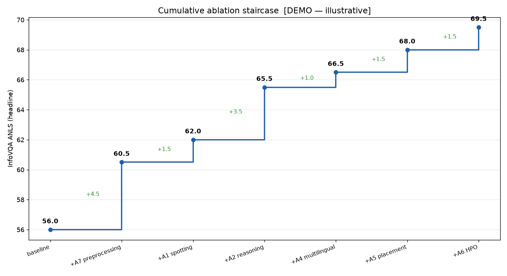
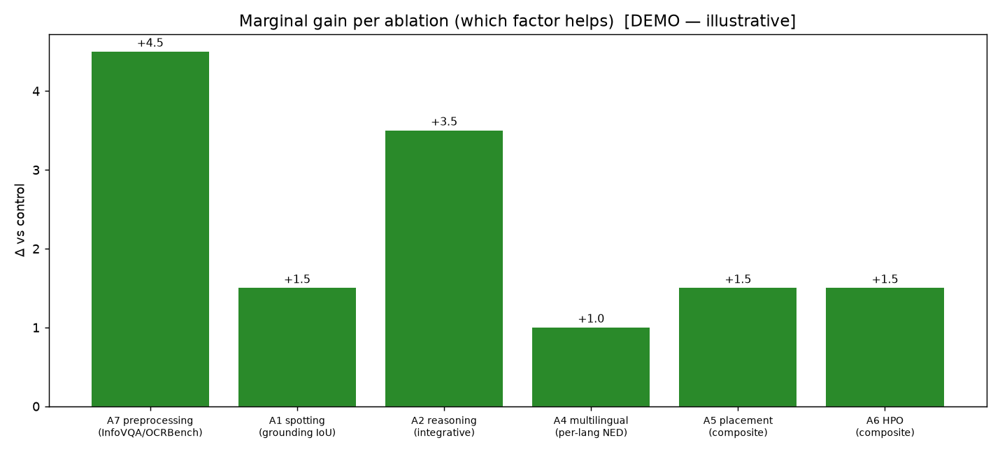
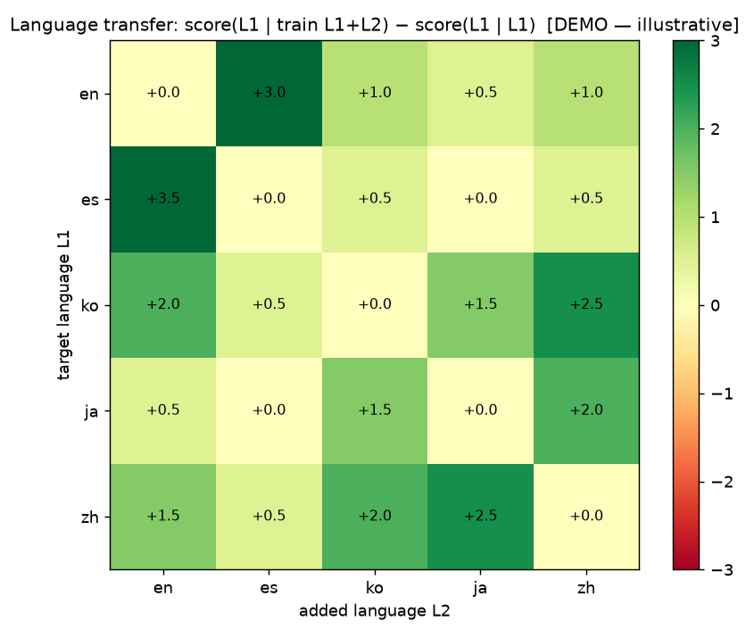
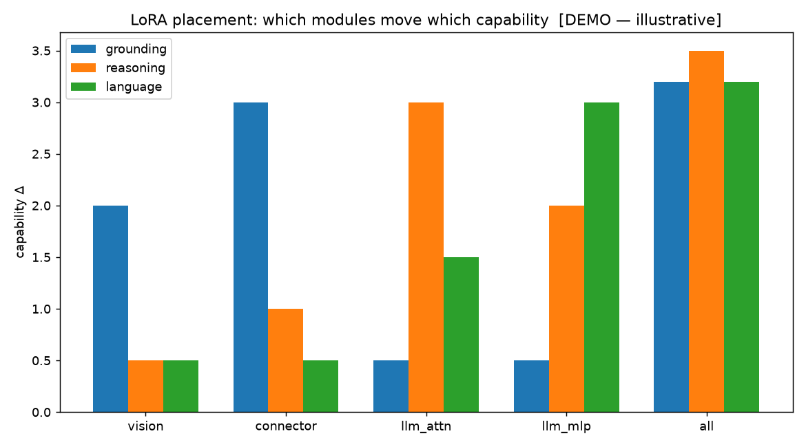
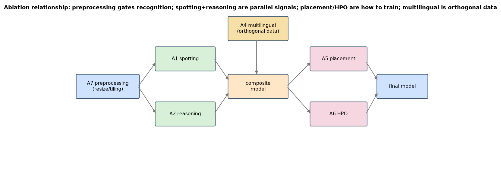

# Ablation plan — improvement via fine-tuning

Once evaluation localises the **best small model's weaknesses** (for InternVL2.5-1B: no spotting/
grounding, weaker InfoVQA layout-reasoning, CJK < EN, rotation/robustness drop), we improve it by
fine-tuning on a document-generation–style dataset (uploaded later). Rather than changing many
things at once, we run **isolated ablations** — each answers one research question with a held-out
control — then **stack the winners** and show a **staircase** of cumulative gain. The per-capability
*which-module-to-adapt* hypotheses these arms test are laid out in
[`research_novelty.md`](research_novelty.md).

Target model: **Qwen3.5-0.8B** (strongest genuinely sub-1B from the full GPU comparison). *LFM2.5-VL
is dropped for our compute budget.* Base data: synthetic document pairs (image → structured text)
from the generator, augmented per-ablation.

**Control factor (held fixed across every arm so a delta is attributable to the factor alone):**
the **number of training images / iterations** (`--count` = #images, `--steps`) and the optimiser/seed
and eval suite. Most arms keep the *image set fixed* and change only **what GT is read per image**
(reasoning = capturing the per-image information diversity instead of missing it); **A4** instead
fixes the **total sample count** and varies the language mix (equal totals → synergy/interference is
comparable). Every arm is scored on the **whole suite** (capability, spatial, realistic) to expose
**cross-capability transfer** — e.g. does spotting also help CER/KIE/reasoning? does a 2nd language
hurt EN? (`scripts/run_ablation.py`).

**A0 — memorization vs understanding (run this first).** Because synthetic data is *infinite*, the
first experiment separates understanding from template-memorization: at each data scale (seed 7),
LoRA-train for a fixed #epochs and score BOTH the train set (memorization) and a **held-out set
generated with a different seed** (unseen content, same distribution; identical for every scale).
Understanding → held-out keeps rising with scale and the train/held-out gap stays small; memorization
→ train→~1.0 while held-out plateaus. The recommended synthetic size is where held-out plateaus.
Run the size sweep with `scripts/run_ablation.py --arm A0 --a0-sizes 25 50 100 200` (full curve:
`50 200 800 3200`); the prerequisite section of `notebooks/finetune_ablation.ipynb` plots the
learning curve + gap and reads off the size. **A0's result fixes the data scale used by A1–A7.**

**Two synthetic-quality axes we scale** (see [`synthetic_data_dto.md`](synthetic_data_dto.md)):
*visual diversity* (14 doc types × acquisition/lighting/colour — `D_visual_diverse`) and *annotation
difficulty* (accountant-style multi-step calc, MRZ field-parse, table-extremes diff, next-action —
the understanding layer). They are the levers A0 trades off (more diversity vs more count).

**Measured baseline gaps the ablations must close** (qwen3.5, from the GPU run): L1 grounding/spotting
≈ 0, L4 box-tracking = 0, H2 relational-compare = 0, 180° rotation collapse, slow latency. The
hypotheses mapping each gap to a module + ablation arm are in
[`research_novelty.md`](research_novelty.md) and shown in
[`../../notebooks/finetune_ablation.ipynb`](../../notebooks/finetune_ablation.ipynb).
The **latency** gap is dissected per-stage/per-layer (why the *smaller* Qwen3.5-0.8B is slower than
LFM2.5-VL-1.6B — vision-token count vs hybrid-conv per-layer cost) in
[`../../notebooks/latency_profile.ipynb`](../../notebooks/latency_profile.ipynb).

> **Spotting coordinate caveat (Qwen3.5-VL).** It smart-resizes the input and emits boxes in the
> *resized* frame's absolute pixels, so a predicted box is offset/scaled vs our original-pixel GT;
> the grounding metric rescales it via `metrics.grounding.rescale_box` (using the processor's
> `image_grid_thw`). Check this before reading A1 grounding numbers.

## Method: one factor at a time → integrate → staircase

For each ablation A_i we train two (or more) variants differing **only** in A_i, evaluate on the
suite, and record Δ vs the control. Winners are composed in dependency order; the cumulative run
should step the headline metric up at each addition (`scripts/plot_ablation.py` draws it).

| ID                                                | Research question                                                                                                                 | Factor varied (data/training)                                             | Control (what stays fixed)  | Primary metric(s)                          | Hypothesis                                                                                 |
| ------------------------------------------------- | --------------------------------------------------------------------------------------------------------------------------------- | ------------------------------------------------------------------------- | --------------------------- | ------------------------------------------ | ------------------------------------------------------------------------------------------ |
| **A1 Spotting supervision**                       | Does adding *where* (bbox) targets to training improve extraction & spatial understanding, vs. answer-only?                       | training target = `value + [x1,y1,x2,y2]` vs `value` only                 | same images/QA, same steps  | grounding IoU; KIE F1; InfoVQA ANLS        | spotting injects spatial grounding → IoU↑ and KIE↑ (localised attention)                   |
| **A2 Reasoning supervision**                      | Does CoT/rationale in the target help integrative reasoning, or is answer-only as good?                                           | target = `rationale → answer` vs `answer`                                 | same data                   | content-reasoning (sum/cmp); InfoVQA               | rationale teaches multi-region procedure → reasoning↑                                      |
| **A3 Spotting+Reasoning vs combined-direct**      | Is it the *act of adding* these signals that helps, or does the plain task combination already capture it?                        | {answer} vs {+spot} vs {+reason} vs {+spot+reason}                        | same data/steps             | composite + per-axis                       | the structured signals beat plain combination; spot & reason are complementary             |
| **A4 Multilingual mixing & language correlation** | Does training several languages in one mix beat single-language? Which language *pairs* transfer?                                 | train sets: {en}, {en+es}, {en+ja}, {ko+en}, {en+zh}, {all}               | equal total samples         | per-language NED (custom_eval)             | related scripts transfer (en↔es, ko↔en); distant scripts (en↔ja) help less or interfere    |
| **A5 LoRA placement**                             | Which modules to adapt to inject which capability — **vision encoder** vs **connector/projector** vs **LLM-attn** vs **LLM-MLP**? | LoRA target_modules set                                                   | rank/alpha/lr fixed         | per-axis (spatial→vision?, reasoning→LLM?) | spatial/recognition gains come from vision+connector; reasoning/language from LLM attn+mlp |
| **A6 Hyperparameter optimization**                | Best rank `r`, `alpha`, lr, epochs for the chosen placement?                                                                      | r∈{8,16,32,64}, α, lr, epochs                                             | placement fixed (A5 winner) | composite + overfit gap                    | moderate r (16–32) best; too-high r overfits the small data                                |
| **A7 Preprocessing / resize logic**               | How does the image-resizing/tiling logic affect small-text & layout?                                                              | dynamic tiling (n_max) vs fixed resize; max-resolution; aspect-ratio keep | model/data fixed            | InfoVQA, OCRBench, small-text NED          | higher-res dynamic tiling → InfoVQA/OCRBench↑ (small text legible)                         |

## A4 detail — language-correlation matrix

We don't just ask "is multilingual better" — we measure **pairwise transfer**:
`transfer(L1←L2) = score_{L1}(train L1+L2) − score_{L1}(train L1)`. A heatmap over
{en, es, ko, ja, zh} reveals complementary pairs (expected positive: en↔es shared latin; ko↔en,
zh↔en via shared doc structure) vs. interference (possible negative: en↔ja if capacity is split).
This guides the final training mix (include synergistic languages, drop interfering ones).

## A5 detail — where to put LoRA (resolved by introspection, not hardcoded)

Because the two bases have different module names (Qwen3.5-VL vs LFM2-VL), the placement groups are
resolved at **runtime** from the loaded model
(`docvlm_eval.finetune.lora_vlm.resolve_lora_targets(model, group)`): every `nn.Linear` is bucketed
by its path into one of the groups below, so the same A5 ablation runs unchanged on either model.

| Target group   | Bucketed by path                                  | Capability it should move                  |
| -------------- | ------------------------------------------------- | ------------------------------------------ |
| Vision encoder | `visual* / vision_tower / siglip / navit / aimv2` | recognition, small-text, layout perception |
| Connector      | `merger / projector / multi_modal / resampler`    | visual→text alignment, **grounding**       |
| LLM attention  | LLM side, leaf `{q,k,v,o}_proj`                    | **reasoning**, cross-region attention      |
| LLM MLP        | LLM side, leaf `{gate,up,down}_proj`              | knowledge, **language/CJK**                |

Each group is a separate LoRA run; we attribute per-axis gains to placement (e.g., if grounding
only improves when the connector+vision are adapted, that confirms the spatial pathway).

## Integration → the staircase

Compose winners in dependency order and re-evaluate after each addition:

```
baseline → +A7 preprocessing → +A1 spotting → +A2 reasoning → +A4 multilingual(synergistic)
         → +A5 best placement → +A6 HPO
```

Expected: a **monotone staircase** on the headline metric (e.g., InfoVQA / composite), with each
step's height = that component's marginal contribution. Plotted by `scripts/plot_ablation.py`
(reads `results/ablation_results.json`). A flat or negative step is itself a finding (component
doesn't help / interferes → drop it).




*(Figures above use illustrative DEMO numbers until the real runs land; regenerate with
`python scripts/plot_ablation.py` once `results/ablation_results.json` holds measured scores.)*

The A4 language-transfer and A5 placement experiments produce:




## Dependency / relationship diagram

Ablations aren't independent: preprocessing gates recognition (A7→A1), spotting and reasoning are
parallel supervision signals that both feed the composite, placement (A5) and HPO (A6) are
*how* we train any of them, and multilingual (A4) is orthogonal data mixing.



## Data generation for the ablations

Each ablation arm is a **synthetic dataset variant** whose ground truth carries the factor being
varied. The generator stores every factor as typed GT (`DocSample` DTO) and exposes one knob per
factor in a single config, so an arm differs from its control in exactly one factor family:

- **Read:** [`synthetic_data_dto.md`](synthetic_data_dto.md) — the GT DTO, the realism/distribution
  matching (digital-native PDF → exact boxes; degradation = acquisition modality; language mix), and
  the **ablation-factor → DTO/config mapping** (A1→`bbox`, A2→`rationale`, A4→`language`, A7→render).
- **Generate:** `python scripts/make_realistic_cases.py --config configs/synth_data.yaml
  --ablation <id>` — `configs/synth_data.yaml` holds `base:` + `ablation_overrides:` (A1/A2/A3/A4/A7).

## Run one arm end-to-end (GPU)

```bash
# baseline (eval only) for both bases, then e.g. the A1 spotting arm on the connector:
python scripts/run_ablation.py --models qwen3_5-0.8b lfm2_5-vl-1.6b --arm baseline
python scripts/run_ablation.py --models qwen3_5-0.8b lfm2_5-vl-1.6b --arm A1_spotting_on --placement connector
```
`run_ablation.py` generates the arm's data → LoRA-fine-tunes (`docvlm_eval.finetune.lora_vlm`,
placement resolved by introspection) → evaluates on the probe suite → appends to
`docs/results/ablation_results.json`, which
[`notebooks/finetune_ablation.ipynb`](../../notebooks/finetune_ablation.ipynb) reads for the
**side-by-side before/after** of both models.

## Outputs & reproducibility
- `configs/synth_data.yaml` — data-generation config: `base` knobs + per-ablation `ablation_overrides`
  (binds to `docvlm_eval.synth.dto.GenConfig`); one file = one dataset variant.
- `configs/ablations.yaml` — declarative ablation registry (two bases, factor, control, metric, gap).
- `scripts/run_ablation.py` — gen → LoRA train → eval → record (per model, per arm).
- `docvlm_eval.finetune.lora_vlm` — model-agnostic LoRA (chat-template) + the A5 placement resolver.
- `scripts/plot_ablation.py` — staircase + Δ bars + transfer heatmap from the results JSON.
- Every variant is scored by the **same** eval pipeline, so the staircase is apples-to-apples.
