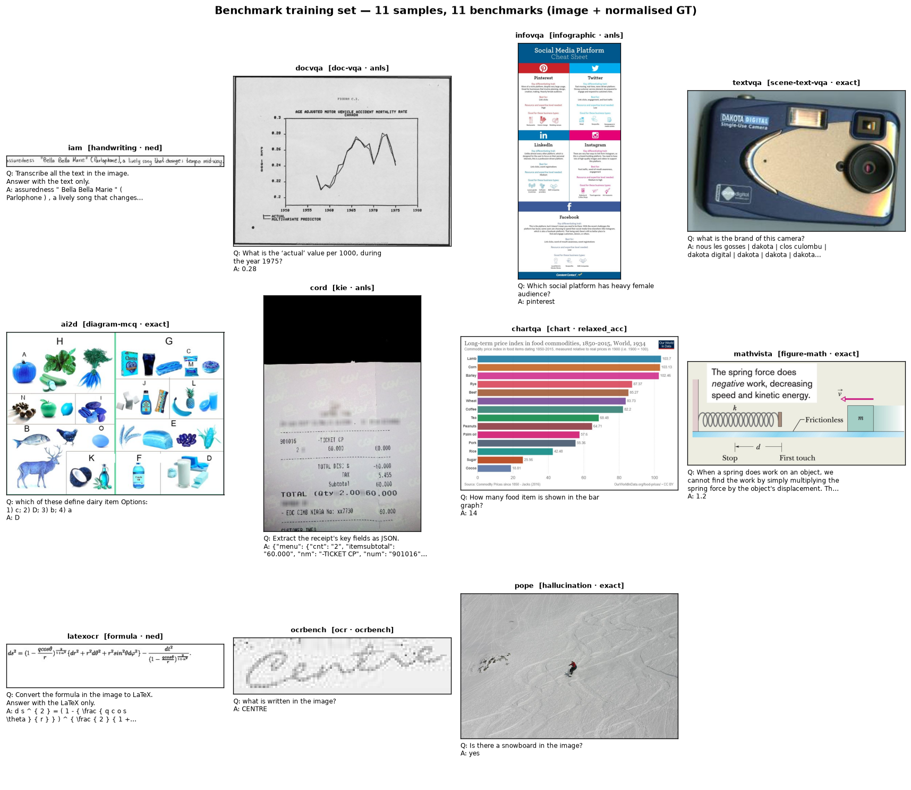

# Benchmark training set — public benchmarks → our training DTO (offline + HF)

The synthetic generator gives us *infinite-looking but finite* data (see
[`ablation_plan.md`](ablation_plan.md) §4). To complement it with **real-world distribution**, this
component loads a small subset of every public benchmark in
[`configs/benchmark_catalog.yaml`](../../configs/benchmark_catalog.yaml) and normalises each into the
**same training DTO** our fine-tuning already consumes — so benchmark data and synthetic data train
through one identical path.

## What "our DTO" is

The canonical record is [`docvlm_eval.schema.Sample`](../../src/docvlm_eval/schema.py), serialised as
JSONL — exactly what `docvlm_eval.finetune.lora_vlm` and `scripts/run_ablation.py` train and eval on:

```json
{"sample_id": "...", "image_path": "...", "question": "...", "answers": ["..."],
 "answer_type": "...", "metric": "anls|exact|relaxed_acc|ned|ocrbench", "meta": {...}}
```

## Per-benchmark adaptation (the hard part)

Every benchmark ships its own raw schema, so a small registry of **pure adapters** maps each into the
DTO ([`src/docvlm_eval/benchmarks/trainset.py`](../../src/docvlm_eval/benchmarks/trainset.py),
`extract_qa(key, ex, entry)`):

| Shape                | Benchmarks                                         | Mapping                                              |
| -------------------- | -------------------------------------------------- | ---------------------------------------------------- |
| Visual QA            | DocVQA, InfoVQA, TextVQA, ST-VQA, OCR-VQA, ChartQA, MathVista, OCRBench(+v2), POPE, HallusionBench, CharXiv | `question` + `answers` (metric per catalog)          |
| Multiple-choice      | AI2D                                               | question + `options[]`, answer resolved from index/text → `exact` |
| Transcription        | IAM, SROIE, FUNSD                                  | "Transcribe…" instruction + the text/words target → `ned` |
| Formula              | im2latex, LaTeX_OCR                                | "Convert to LaTeX" + the LaTeX target → `ned`        |
| KIE (JSON)           | CORD                                               | parse `ground_truth.gt_parse` → "Extract key fields as JSON" |
| Table                | PubTabNet, FinTabNet                               | "Convert the table to HTML" + the HTML target        |
| Fallback (`_auto`)   | anything unregistered                              | VQA → transcription → `conversations` (LLaVA turns)  |

Detection-only records (no derivable question/answer, e.g. PubTables-1M boxes) yield `[]` and are
skipped. The adapters are unit-tested **offline** against hand-built records mimicking each real
schema ([`tests/test_benchmark_trainset.py`](../../tests/test_benchmark_trainset.py)).

## Build it (offline, < 200 images/benchmark)

```bash
# stream a subset of every streamable benchmark; cache images + write the merged trainset
python scripts/build_benchmark_trainset.py --per-bench 50
# a focused subset, more per benchmark:
python scripts/build_benchmark_trainset.py --only docvqa,chartqa,cord --per-bench 150
```

Outputs under `data/benchmark_trainset/` (git-ignored — regenerable / lives on HF):

- `train.jsonl` — merged `Sample`s, **directly trainable** (`run_ablation` / `lora_vlm`).
- `per_bench/<key>.jsonl` — per-benchmark splits.
- `hf_dataset/` — an Arrow `datasets.Dataset` (image cast to the HF `Image` feature).
- `metadata.jsonl` + `images/` — an HF *imagefolder* layout for raw upload.
- `summary.json` — per-benchmark counts + any failures.

## Why offline + a new HF dataset

Streaming 20+ datasets every run is slow and flaky. Build **once**, then publish as one HF dataset and
`load_dataset` it in seconds thereafter. Either:

```bash
# A) one command, build + push:
python scripts/build_benchmark_trainset.py --push-to-hub <user>/docvlm-benchmark-trainset
# B) build offline, upload the prepared Arrow dataset yourself:
python -c "from datasets import load_from_disk as L; \
           L('data/benchmark_trainset/hf_dataset').push_to_hub('<user>/docvlm-benchmark-trainset')"
# C) or upload the raw imagefolder:
huggingface-cli upload --repo-type dataset <user>/repo data/benchmark_trainset .
```

## Visualize the dataset + GT

A montage (cached image + normalised question/answer/metric per benchmark) sanity-checks the mapping:

```bash
python scripts/visualize_benchmark_trainset.py --per-bench 1
```


