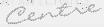
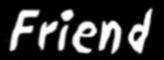
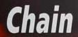
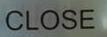
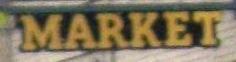

# Pseudo-labeling empty UDD columns with LLM/VLM labelers — design + real fills

How model-generated labels fill the corpus's structurally empty columns without ever polluting
gold: **filler → standardized prompt → labeler model → normalizer (standardize-or-reject) →
cross-check → provenance**. Everything below ran for real; the example fills at the bottom are
actual outputs committed from a CPU run.

## 1. What is empty, and what fills it

`plan(ds)` (no model loaded) reports the fillable surface. On the 39,837-row corpus the dominant
gap is `full_text` — every document image has a transcript but only recognition rows ship one —
plus class-only layout boxes and table rows without structure HTML:

| filler | column | what fills it | labeler models |
|---|---|---|---|
| `full_text` | `full_text` | full-page transcript | got-ocr2, paddleocr-vl (GPU); smolvlm-256m (CPU demo) |
| `region_text` | `elements_json` | text of box-only layout regions (crop → OCR) | got-ocr2, paddleocr-vl |
| `table_html` | `table_html` | `<table>` structure for table rows missing it | got-ocr2 |

`vlm_labeler(model_key, filler)` wraps ANY model registered in `docvlm_eval.models` into a
labeler; **the prompt lives on the filler, not the model**, so every labeler answers the same
standardized instruction and outputs stay comparable when the model is upgraded.

## 2. Standardization (the output contract)

A raw model response is never written to the corpus. Each filler owns a normalizer that either
returns the standardized value or **rejects** (row stays unfilled, no provenance):

| rule | example |
|---|---|
| chat wrappers stripped | `The text in the image reads: "TOTAL 25,000 KRW"` → `TOTAL 25,000 KRW` |
| whitespace runs collapsed, newlines kept (reading order) | `Invoice\n\n\n\nNo. 42` → `Invoice\n\nNo. 42` |
| unicode NFC, surrounding quotes dropped | mixed-width forms unified |
| refusals rejected | `I cannot read this image.` → **None** |
| empty / over-long (>8k chars) rejected | runaway generations never land |
| `table_html`: keep exactly the `<table>…</table>` block | `Sure! <table>…</table> enjoy` → `<table>…</table>` |

**Cross-check against the row's own gold** (`agrees_with_gold`): extraction-style golds are spans
of the page text, so at least one gold answer should appear in a filled transcript — a free
verification gate for GPU-scale runs (see the FAIL row below for why it earns its place).

**Provenance is mandatory**: every filled value is marked in `pseudo_json`
(`{"full_text": "smolvlm-256m"}`), so pseudo-labels are always distinguishable from source GT,
filterable, and regenerable with a better model. Gold is never overwritten — fillers only touch
rows whose column is empty.

## 3. Real fills (committed outputs of a CPU run)

`python scripts/pseudo_label_udd.py --apply full_text --model smolvlm-256m --limit 6` on OCRBench
crops whose `full_text` was empty. These rows also carry gold VQA answers, so the cross-check
column is computable:

| image | sample | before | filled `full_text` | `pseudo_json` | gold answer | cross-check |
|---|---|---|---|---|---|---|
|  | `ocrbench_0000_0` | *(empty)* | `P.E.R.I.T.E.R.` | `{"full_text": "smolvlm-256m"}` | CENTRE | **FAIL — rejected at scale** |
|  | `ocrbench_0001_0` | *(empty)* | `Friend` | `{"full_text": "smolvlm-256m"}` | FRIEND | PASS |
|  | `ocrbench_0002_0` | *(empty)* | `chain` | `{"full_text": "smolvlm-256m"}` | CHAIN | PASS |
|  | `ocrbench_0003_0` | *(empty)* | `CLOSE.` | `{"full_text": "smolvlm-256m"}` | CLOSE | PASS |
|  | `ocrbench_0004_0` | *(empty)* | `Market.` | `{"full_text": "smolvlm-256m"}` | MARKET | PASS |
|  | `ocrbench_0005_0` | *(empty)* | `EXTRA` | `{"full_text": "smolvlm-256m"}` | EXTRA | PASS |

Five of six fills agree with gold (case/punct differences are exactly what the corpus's tolerant
metrics absorb). The sixth — `P.E.R.I.T.E.R.` for a crop whose gold is `CENTRE` — is a 256M-model
hallucination: `agrees_with_gold` returns False and a scaled run drops it. That one row is the
whole argument for the reject-not-trust design: a bigger labeler (got-ocr2 / paddleocr-vl) raises
the pass rate, and the gate catches what remains.

## 4. Running it

```bash
python scripts/pseudo_label_udd.py                      # plan only — counts per filler/source
python scripts/pseudo_label_udd.py --apply full_text --model smolvlm-256m --limit 6   # CPU demo
python scripts/pseudo_label_udd.py --apply full_text --model got-ocr2 --device cuda   # at scale
```

The filled dataset saves beside the source (`<src>_pseudo`); training can include pseudo rows or
exclude them by filtering `pseudo_json`.
