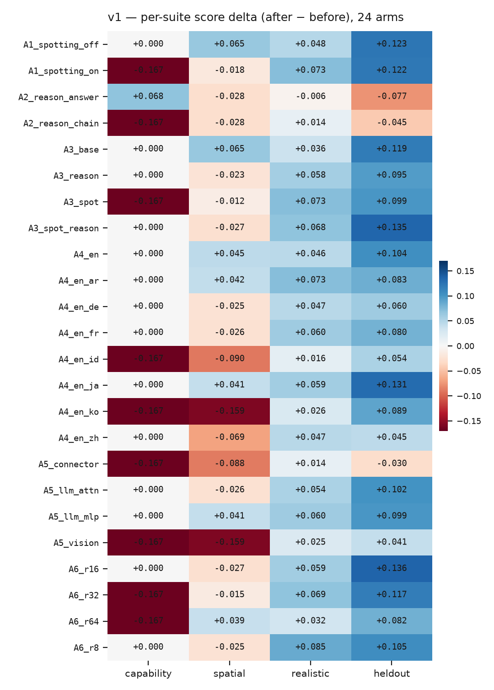
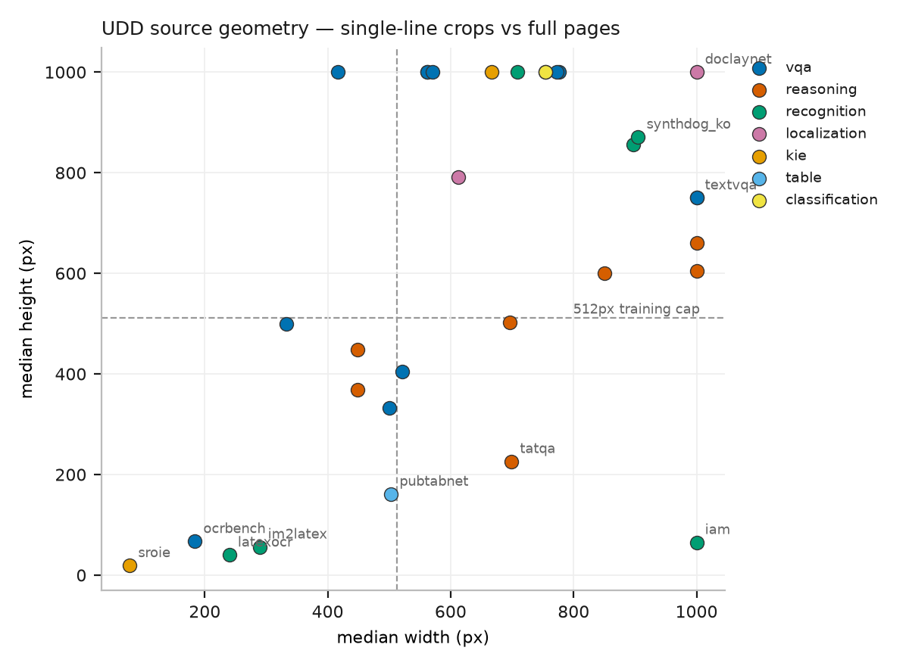
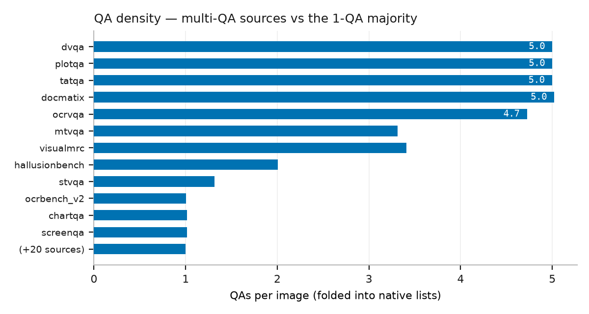
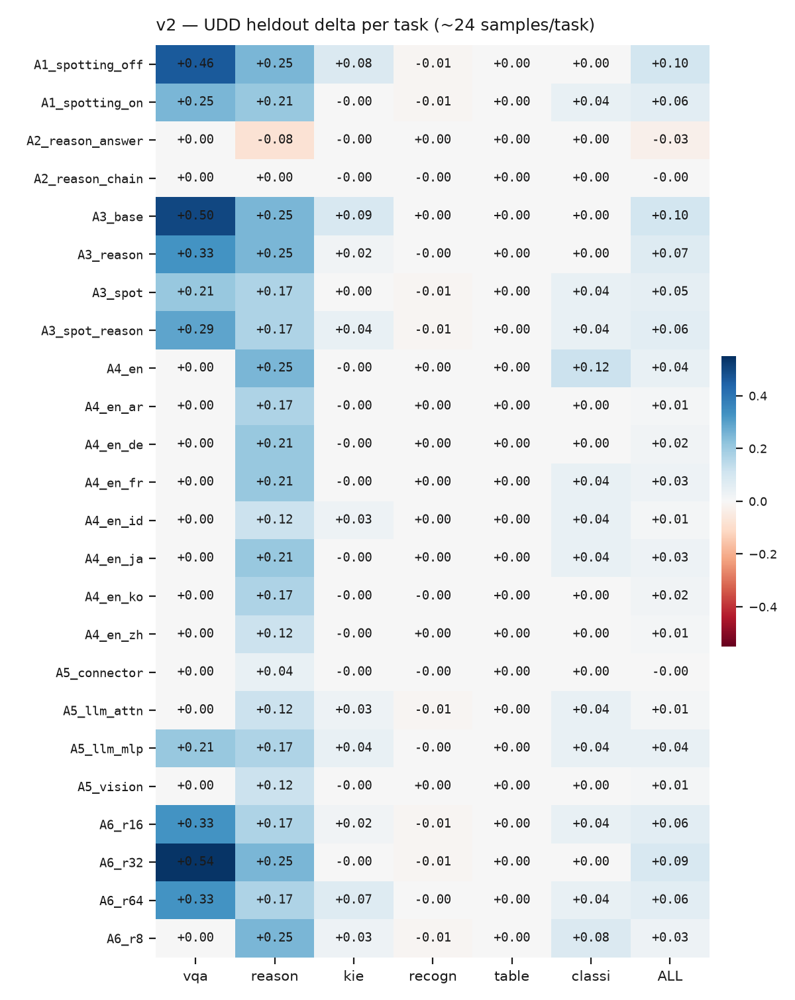
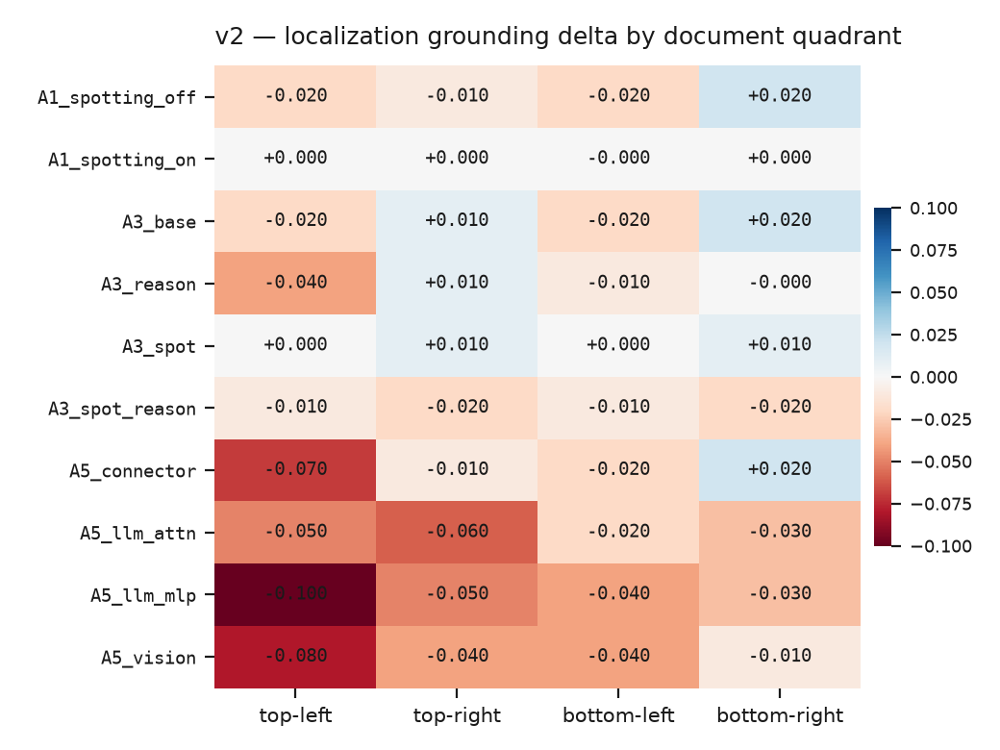

<h1>Adapting a Sub-1B Vision-Language Model for Document Understanding — 
A One-Factor-at-a-Time LoRA Ablation on the Unified Document Dataset (UDD)</h1>

<b>Sangbum Choi / PF MLS</b> 
2026-07-06  
Model: LiquidAI/LFM2.5-VL-1.6B (LoRA) 
Environment: Kubeflow thor2-h100 (NVIDIA H100 NVL) 
Dataset: danelcsb/UDD (public Hub release) — 9086 images / 16708 QAs / 32 source benchmarks / 7 tasks 
Regime: 512px images, 300 steps/arm, single seed. Relative signal, NOT absolute SOTA.

Table of contents

[TOC]

## 1. Executive summary

Question: when LoRA-finetuning a small (&le;1B) document VLM, WHICH training factor actually
helps? We vary one factor at a time across 24 arms (A1..A6), train each, and score the
base-vs-adapted model. Two evaluation designs:

* **v1** = 4 suites, 3 of them EXTERNAL synthetic probes + UDD heldout (64-cap).
* **v2** = UDD-ONLY: per-task heldout + localization sliced by document quadrant (region).

<b>HEADLINE:</b> 'HOW you train' (A5 LoRA placement, A6 rank) beats 'WHAT signal you add'
(A1 spotting, A2 rationale). Best recipe: LoRA on LLM attn/mlp, rank 16-32, spot+reason data.  
<b>KEY v2 FINDING (region):</b> LLM-module placements lift vqa/reasoning but SYSTEMATICALLY
degrade localization (worst top-left, llm_mlp -0.10); only spotting arms keep grounding.  
<b>REVERSAL:</b> A2 chain-of-thought/rationale supervision did NOT help — it hurt.

## 2. Experiment design (per factor: WHAT / VERIFY / HOW / CONCLUSION)

### 2.1 A1 Spotting

* **WHAT (variation):** Add bbox('where') targets to training or not (on=vqa+kie+localization thirds vs off=vqa+kie halves), equal N=796, same steps.
* **VERIFY (hypothesis):** Does teaching location improve extraction/space vs answer-only? Does it transfer beyond localization?
* **HOW (method):** Train A1_spotting_on vs A1_spotting_off, score UDD heldout before/after.
* **CONCLUSION:** Both ~+0.1 heldout; on keeps grounding neutral but trades vqa. Spotting's cross-transfer NOT confirmed at this scale.

### 2.2 A2 Reasoning

* **WHAT (variation):** Same (image,question,element) with target = rationale->answer (chain) vs answer-only. Only the rationale text differs. N=2327.
* **VERIFY (hypothesis):** Does chain-of-thought supervision improve integrative reasoning, or is answer-only enough?
* **HOW (method):** Train A2_reason_chain vs A2_reason_answer, controlled pair.
* **CONCLUSION:** REVERSAL: both &le; 0 on heldout; rationale not better than answer. CoT supervision hurt at this scale/quality.

### 2.3 A3 Combination

* **WHAT (variation):** {base=vqa+kie} / {+spot} / {+reason} / {+spot+reason}, equal N=796.
* **VERIFY (hypothesis):** Is it the act of ADDING signals, or does plain task combination already capture it? Are spot & reason complementary?
* **HOW (method):** Train 4 arms same total, compare heldout per task.
* **CONCLUSION:** spot_reason strong on vqa (+0.29) & reasoning; base already strong. Combination &ge; single.

### 2.4 A4 Multilingual

* **WHAT (variation):** Training language mix {en} vs {en+X}, X in {ko,ja,ar,zh,id,fr,de}, equal N=178.
* **VERIFY (hypothesis):** Does multilingual mixing beat single-language? Which language pairs transfer/interfere?
* **HOW (method):** Train per mix, score UDD heldout (+ per-language).
* **CONCLUSION:** en alone best overall (reasoning +0.25); adding languages diluted; distant scripts (ko/id/zh) weakest.

### 2.5 A5 Placement

* **WHAT (variation):** Fixed composite mix; vary WHERE LoRA is placed: vision / connector / llm_attn / llm_mlp.
* **VERIFY (hypothesis):** Which module routes which capability?
* **HOW (method):** Data & rank fixed, placement varied; read per-task + per-region transfer.
* **CONCLUSION:** llm_mlp best (vqa+reasoning); connector worst. NEW: LLM-module placements degrade localization (see Section 5.2).

### 2.6 A6 HPO (rank)

* **WHAT (variation):** Fixed mix & placement; vary LoRA rank r in {8,16,32,64} (alpha=2r).
* **VERIFY (hypothesis):** Optimal rank? Does too-high rank overfit small data?
* **HOW (method):** Vary rank only, score heldout + overfit signals.
* **CONCLUSION:** Moderate rank r16-r32 best (r32 vqa +0.54); r8 weakest; r64 overfits (v1 realistic:consistency -0.75).

Figure 1 — v1 coarse per-suite delta (after − before), 24 arms.

## 3. The data (UDD): 32 benchmarks and their internal differences

UDD unifies 32 public benchmarks (one row per image, native QA lists, leakage-safe fold).
Per-source breakdown:

| source | imgs | QAs | task | metric | med_dim | held |
|---|---:|---:|---|---|---|---:|
| ai2d | 300 | 300 | vqa | exact | 521x404 | 24 |
| charxiv | 300 | 300 | reasoning | exact | 1000x660 | 26 |
| doclaynet | 300 | 300 | localization | grounding | 1000x1000 | 28 |
| docvqa | 300 | 300 | vqa | anls | 776x1000 | 23 |
| dvqa | 300 | 1500 | reasoning | anls | 448x448 | 30 |
| iam | 300 | 300 | recognition | ned | 1000x65 | 30 |
| im2latex | 300 | 300 | recognition | ned | 289x56 | 26 |
| infovqa | 300 | 300 | vqa | anls | 417x1000 | 16 |
| latexocr | 300 | 300 | recognition | ned | 240x40 | 27 |
| mathvista | 300 | 300 | reasoning | exact | 448x369 | 34 |
| ocrbench | 300 | 300 | vqa | ocrbench | 184x67 | 28 |
| ocrvqa | 300 | 1417 | vqa | exact | 333x500 | 33 |
| plotqa | 300 | 1500 | reasoning | anls | 1000x604 | 40 |
| publaynet | 300 | 300 | localization | grounding | 612x792 | 26 |
| pubtabnet | 300 | 300 | table | anls | 503x161 | 37 |
| sroie | 300 | 300 | kie | ned | 78x19 | 37 |
| stvqa | 300 | 394 | vqa | anls | 500x333 | 30 |
| synthdog_en | 300 | 300 | recognition | ned | 897x856 | 27 |
| synthdog_ko | 300 | 300 | recognition | ned | 905x871 | 25 |
| tatqa | 300 | 1499 | reasoning | anls | 699x226 | 26 |
| textvqa | 300 | 300 | vqa | exact | 1000x750 | 38 |
| mtvqa | 299 | 990 | vqa | anls | 1000x750 | 32 |
| ocrbench_v2 | 299 | 301 | vqa | exact | 562x1000 | 33 |
| omnidocbench | 299 | 299 | recognition | ned | 708x1000 | 27 |
| rvl_cdip | 298 | 298 | classification | exact | 754x1000 | 29 |
| chartqa | 296 | 300 | reasoning | relaxed_acc | 850x600 | 35 |
| screenqa | 294 | 298 | vqa | anls | 562x1000 | 33 |
| docmatix | 287 | 1441 | vqa | anls | 773x1000 | 21 |
| hallusionbench | 286 | 574 | reasoning | exact | 696x502 | 24 |
| visualmrc | 278 | 947 | vqa | anls | 571x1000 | 30 |
| cord | 100 | 100 | kie | anls | 667x1000 | 11 |
| funsd | 50 | 50 | kie | ned | 754x1000 | 4 |

SIX AXES OF DIFFERENCE WITHIN UDD:

* **(a) 7 output contracts:** span-answer / gold-list(ANLS) / transcription(NED) / structured-record(F1) / structure-tree(TEDS) / layout(grounding) / reliability. Same 'doc understanding' label, different heads.
* **(b) Image geometry extremes:** crops (sroie 78x19, latexocr 240x40, iam 1000x65 single-line) vs full-page (doclaynet 1000x1000, textvqa 1000x750). 512px cap shrinks ONLY full-page sources.
* **(c) QA density:** most 1 QA/img; chart/doc-VQA multi-QA (dvqa/plotqa/tatqa/ocrvqa/docmatix ~5 QA/img).
* **(d) Language:** en 83.6%; thin multilingual tail (ja 60, fr 49, de 44, ar 42) -> A4 equal-N shrinks to 178.
* **(e) Metric tolerance** varies even within a task (vqa: exact vs anls vs ocrbench).
* **(f) Structural density:** kie n_fields median 40 (max 433); localization n_regions median 11 (max 66).

Figure 2 — image-geometry extremes across the 32 sources.

Figure 3 — QA density: multi-QA sources vs the 1-QA majority.

## 4. v1 results (4 suites incl. external probes; before->after delta)

| arm | capability | spatial | realistic | heldout |
|---|---|---|---|---|
| A1_spotting_off | 0.833→0.833(+0.000) | 0.694→0.759(+0.065) | 0.264→0.312(+0.048) | 0.284→0.407(+0.123) |
| A1_spotting_on | 0.833→0.667(-0.167) | 0.694→0.676(-0.018) | 0.264→0.337(+0.073) | 0.284→0.406(+0.122) |
| A2_reason_answer | 0.833→0.901(+0.068) | 0.694→0.667(-0.028) | 0.264→0.259(-0.006) | 0.284→0.207(-0.077) |
| A2_reason_chain | 0.833→0.667(-0.167) | 0.694→0.667(-0.028) | 0.264→0.278(+0.014) | 0.284→0.239(-0.045) |
| A3_base | 0.833→0.833(+0.000) | 0.694→0.759(+0.065) | 0.264→0.300(+0.036) | 0.284→0.403(+0.119) |
| A3_reason | 0.833→0.833(+0.000) | 0.694→0.672(-0.023) | 0.264→0.322(+0.058) | 0.284→0.379(+0.095) |
| A3_spot | 0.833→0.667(-0.167) | 0.694→0.682(-0.012) | 0.264→0.337(+0.073) | 0.284→0.383(+0.099) |
| A3_spot_reason | 0.833→0.833(+0.000) | 0.694→0.667(-0.027) | 0.264→0.332(+0.068) | 0.284→0.419(+0.135) |
| A4_en | 0.833→0.833(+0.000) | 0.694→0.739(+0.045) | 0.264→0.310(+0.046) | 0.284→0.388(+0.104) |
| A4_en_ar | 0.833→0.833(+0.000) | 0.694→0.736(+0.042) | 0.264→0.337(+0.073) | 0.284→0.367(+0.083) |
| A4_en_de | 0.833→0.833(+0.000) | 0.694→0.669(-0.025) | 0.264→0.311(+0.047) | 0.284→0.344(+0.060) |
| A4_en_fr | 0.833→0.833(+0.000) | 0.694→0.669(-0.026) | 0.264→0.324(+0.060) | 0.284→0.364(+0.080) |
| A4_en_id | 0.833→0.667(-0.167) | 0.694→0.605(-0.090) | 0.264→0.280(+0.016) | 0.284→0.338(+0.054) |
| A4_en_ja | 0.833→0.833(+0.000) | 0.694→0.735(+0.041) | 0.264→0.323(+0.059) | 0.284→0.415(+0.131) |
| A4_en_ko | 0.833→0.667(-0.167) | 0.694→0.535(-0.159) | 0.264→0.290(+0.026) | 0.284→0.373(+0.089) |
| A4_en_zh | 0.833→0.833(+0.000) | 0.694→0.626(-0.069) | 0.264→0.311(+0.047) | 0.284→0.329(+0.045) |
| A5_connector | 0.833→0.667(-0.167) | 0.694→0.606(-0.088) | 0.264→0.278(+0.014) | 0.284→0.254(-0.030) |
| A5_llm_attn | 0.833→0.833(+0.000) | 0.694→0.668(-0.026) | 0.264→0.318(+0.054) | 0.284→0.386(+0.102) |
| A5_llm_mlp | 0.833→0.833(+0.000) | 0.694→0.735(+0.041) | 0.264→0.324(+0.060) | 0.284→0.383(+0.099) |
| A5_vision | 0.833→0.667(-0.167) | 0.694→0.535(-0.159) | 0.264→0.289(+0.025) | 0.284→0.325(+0.041) |
| A6_r16 | 0.833→0.833(+0.000) | 0.694→0.667(-0.027) | 0.264→0.324(+0.059) | 0.284→0.420(+0.136) |
| A6_r32 | 0.833→0.667(-0.167) | 0.694→0.679(-0.015) | 0.264→0.333(+0.069) | 0.284→0.401(+0.117) |
| A6_r64 | 0.833→0.667(-0.167) | 0.694→0.733(+0.039) | 0.264→0.296(+0.032) | 0.284→0.366(+0.082) |
| A6_r8 | 0.833→0.833(+0.000) | 0.694→0.669(-0.025) | 0.264→0.349(+0.085) | 0.284→0.389(+0.105) |

NOTE: capability n=6 (+-0.167 noise). 3 of 4 suites are NOT UDD -> conflates improvement with cross-dataset transfer.

## 5. v2 results (within-UDD, external probes removed)

### 5.1 Task transfer — delta per UDD task (heldout only, ~24/task)

| arm | vqa | reason | kie | recogn | table | classi | ALL |
|---|---:|---:|---:|---:|---:|---:|---:|
| A1_spotting_off | +0.46 | +0.25 | +0.08 | -0.01 | +0.00 | +0.00 | +0.10 |
| A1_spotting_on | +0.25 | +0.21 | -0.00 | -0.01 | +0.00 | +0.04 | +0.06 |
| A2_reason_answer | +0.00 | -0.08 | -0.00 | +0.00 | +0.00 | +0.00 | -0.03 |
| A2_reason_chain | +0.00 | +0.00 | -0.00 | -0.00 | +0.00 | +0.00 | -0.00 |
| A3_base | +0.50 | +0.25 | +0.09 | +0.00 | +0.00 | +0.00 | +0.10 |
| A3_reason | +0.33 | +0.25 | +0.02 | -0.00 | +0.00 | +0.00 | +0.07 |
| A3_spot | +0.21 | +0.17 | +0.00 | -0.01 | +0.00 | +0.04 | +0.05 |
| A3_spot_reason | +0.29 | +0.17 | +0.04 | -0.01 | +0.00 | +0.04 | +0.06 |
| A4_en | +0.00 | +0.25 | -0.00 | +0.00 | +0.00 | +0.12 | +0.04 |
| A4_en_ar | +0.00 | +0.17 | -0.00 | +0.00 | +0.00 | +0.00 | +0.01 |
| A4_en_de | +0.00 | +0.21 | -0.00 | +0.00 | +0.00 | +0.00 | +0.02 |
| A4_en_fr | +0.00 | +0.21 | -0.00 | +0.00 | +0.00 | +0.04 | +0.03 |
| A4_en_id | +0.00 | +0.12 | +0.03 | +0.00 | +0.00 | +0.04 | +0.01 |
| A4_en_ja | +0.00 | +0.21 | -0.00 | +0.00 | +0.00 | +0.04 | +0.03 |
| A4_en_ko | +0.00 | +0.17 | -0.00 | -0.00 | +0.00 | +0.00 | +0.02 |
| A4_en_zh | +0.00 | +0.12 | -0.00 | +0.00 | +0.00 | +0.00 | +0.01 |
| A5_connector | +0.00 | +0.04 | -0.00 | -0.00 | +0.00 | +0.00 | -0.00 |
| A5_llm_attn | +0.00 | +0.12 | +0.03 | -0.01 | +0.00 | +0.04 | +0.01 |
| A5_llm_mlp | +0.21 | +0.17 | +0.04 | -0.00 | +0.00 | +0.04 | +0.04 |
| A5_vision | +0.00 | +0.12 | -0.00 | +0.00 | +0.00 | +0.00 | +0.01 |
| A6_r16 | +0.33 | +0.17 | +0.02 | -0.01 | +0.00 | +0.04 | +0.06 |
| A6_r32 | +0.54 | +0.25 | -0.00 | -0.01 | +0.00 | +0.00 | +0.09 |
| A6_r64 | +0.33 | +0.17 | +0.07 | -0.00 | +0.00 | +0.04 | +0.06 |
| A6_r8 | +0.00 | +0.25 | +0.03 | -0.01 | +0.00 | +0.08 | +0.03 |

### 5.2 Localization region transfer — delta grounding by document quadrant (KEY NEW FINDING)

| arm | TL | TR | BL | BR |
|---|---:|---:|---:|---:|
| A1_spotting_off | -0.02 | -0.01 | -0.02 | +0.02 |
| A1_spotting_on | +0.00 | +0.00 | -0.00 | +0.00 |
| A3_base | -0.02 | +0.01 | -0.02 | +0.02 |
| A3_reason | -0.04 | +0.01 | -0.01 | -0.00 |
| A3_spot | +0.00 | +0.01 | +0.00 | +0.01 |
| A3_spot_reason | -0.01 | -0.02 | -0.01 | -0.02 |
| A5_connector | -0.07 | -0.01 | -0.02 | +0.02 |
| A5_llm_attn | -0.05 | -0.06 | -0.02 | -0.03 |
| A5_llm_mlp | -0.10 | -0.05 | -0.04 | -0.03 |
| A5_vision | -0.08 | -0.04 | -0.04 | -0.01 |

<b>BOXED KEY FINDING:</b> A5 LLM-module placements (llm_mlp/attn/vision) systematically degrade
localization, worst top-left (llm_mlp TL -0.10, vision -0.08, connector -0.07). Only spotting
arms (A1_spotting_on, A3_spot) keep grounding neutral. =&gt; trade-off: reading/reasoning via LLM
modules is bought at the cost of locating. Top-left is the most fragile region across all arms.

Figure 4 — v2 per-task heldout delta.

Figure 5 — v2 grounding delta by document quadrant.

## 6. Conclusions

1. HOW-you-train (A5 placement, A6 rank) &gt; WHAT-signal (A1 spotting, A2 rationale) at this scale.
2. Recommended recipe: LoRA on LLM attn/mlp, rank 16-32, data mix incl. spot+reason.
3. A2 rationale/chain-of-thought supervision was a REVERSAL — it hurt.
4. Placement routes capability AND trades it: LLM modules -> vqa/reasoning up, localization down. Keep spotting targets in the data if grounding matters.
5. Evaluation design matters: external-probe v1 mixed transfer-to-another-dataset with improvement; within-UDD task+region (v2) is the clean read and revealed the region trade-off v1 could not.

## 7. Caveats

* Relative signal, not absolute conclusions: 512px (not native res), 300 steps, single seed, small LoRA.
* Hub UDD release (9,086 imgs, &le;300/source) is smaller than the author's full build (28,299).
* v1 capability suite n=6 (+-0.167 per sample) -> treat as noise.
* v2 heldout is a balanced 192-row subset (task ~24, localization region ~12) -> directional, not high-precision.
* recognition/table/classification deltas ~flat: too few samples / 512px hurts OCR crops.
