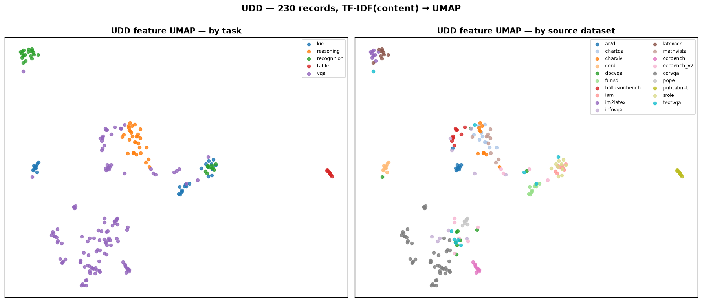
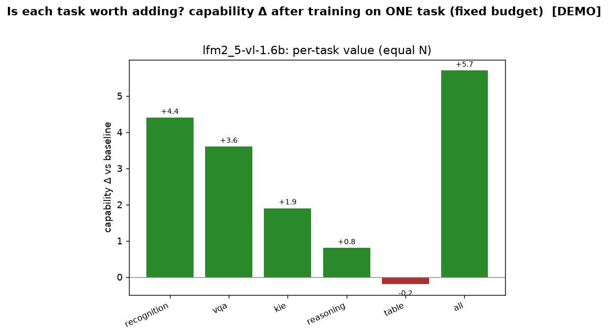

# Unified loader — one task-typed format for every OCR/document dataset

Every benchmark ships a different raw schema. To load them all through **one** pipeline and then
*freely merge / filter / re-task*, we normalise each into a single task-typed record,
[`UnifiedSample`](../../src/docvlm_eval/unified/), that **preserves the structured
payload** each task needs (KIE fields, localization boxes, table HTML, full text) — not just a
flat question/answer.

```python
from docvlm_eval.unified import UnifiedLoader, Task
L = UnifiedLoader()
rows  = L.load("cord", limit=50)                     # one dataset
allr  = L.load_all(limit_per=30, cache_dir="data/unified_dataset/images")
kie   = [r for r in allr["cord"] if r.task == Task.KIE]
boxes = [f for r in rows for f in r.fields if f.bbox]   # merge localized fields across sources
```

## The unified record

`UnifiedSample` (one item, any dataset):

| field | meaning |
| ----- | ------- |
| `task` | `recognition` / `kie` / `vqa` / `localization` / `table` / `reasoning` (what to filter/merge on) |
| `instruction`, `answers` | the prompt + gold answer(s) |
| `fields: [Field(key, value, bbox?)]` | **key-value extraction** (forms/receipts), optionally localized |
| `regions: [Region(label, bbox, text)]` | **localization / spotting** boxes |
| `full_text`, `table_html` | **recognition** target / **table** structure |
| `language`, `metric`, `image_path`, `source`, `hf_id`, `meta` | provenance + scoring |

Boxes carry a `normalized` flag (`[0,1]` vs pixel) so cross-dataset geometry is unambiguous.
`UnifiedSample.to_sample()` collapses a record back to the flat training
[`Sample`](../../src/docvlm_eval/schema.py) (deriving a target from `full_text`/`table_html`/`fields`
when there's no explicit answer), so the unified layer is a **superset** of `trainset.py`.

## Format variance handled (raw schema → unified)

Verified against the real datasets (not assumed):

| Benchmark | Raw shape | → task | Structured payload captured |
| --------- | --------- | ------ | --------------------------- |
| DocVQA / InfoVQA / TextVQA / ST-VQA | `question` + `answers[]` | vqa | answers |
| OCR-VQA | `questions[]` / `answers[]` + `ocr_info[{word, bounding_box}]` | vqa | **regions** (per-word, normalized 0–1) |
| ChartQA / MathVista / CharXiv | `question`/`query` + `answer` | reasoning | answers |
| AI2D | `question` + `options[]` + index `answer` | vqa | answer resolved from options |
| CORD | JSON `ground_truth.gt_parse` + `valid_line[{words[{text,quad}]}]` | kie | **fields** (flattened gt_parse) + **localized fields** (quad→pixel box) |
| FUNSD | `words[]` + `bboxes[]` (0–1000) + `ner_tags[]` | kie | **fields** with boxes (rescaled to 0–1) + `full_text` |
| SROIE | text/label | kie | answer (recognition-style) |
| PubTabNet / FinTabNet | `html_table` | table | `table_html` |
| IAM | `text` | recognition | `full_text` |
| im2latex / LaTeX_OCR | `latex`/`text` | recognition | formula text |
| OCRBench(+v2) / POPE / HallusionBench | `question` + `answer` | vqa | answers |
| *unregistered* | (any) | per `TASK_BY_BENCHMARK`, else vqa | via `trainset.extract_qa` fallback |

Records that yield no usable payload (e.g. detection-only streams with no text/QA) return `[]` and
are skipped.

## Easy extension — add a dataset in one function

The registry is a decorator. To support a new benchmark, write an extractor and register its catalog
key — nothing else changes:

```python
from docvlm_eval.unified import register, UnifiedSample, Task, _s

@register("my_new_bench")
def _u_my_bench(ex, e):
    return [UnifiedSample(
        sample_id="", source=e["key"], task=Task.KIE,
        instruction="Extract the fields.",
        fields=[Field(key=k, value=_s(v)) for k, v in ex["kv"].items()],
        metric="anls")]
```

Unregistered keys automatically fall back to the flat `trainset` adapter wrapped by task
(`TASK_BY_BENCHMARK`), so a new dataset works *immediately* as VQA/recognition even before you write
a typed extractor; the extractor just adds the structured payload.

## Build the standardized dataset

```bash
python scripts/build_unified_dataset.py --per-bench 50            # all streamable datasets
python scripts/build_unified_dataset.py --only cord,funsd,ocrvqa  # focused
python scripts/build_unified_dataset.py --task kie                # only KIE-yielding benchmarks
```

Outputs under `data/unified_dataset/` (git-ignored — regenerable):
`unified.jsonl` (rich, task-typed), `by_task/<task>.jsonl` (grouped), `train.jsonl` (flat trainable
Samples), `summary.json` (per-benchmark + per-task counts, incl. how many records carry boxes).

## Visualize examples across all datasets

```bash
python scripts/visualize_unified_dataset.py --per-bench 1
```

One montage cell per dataset: the image + a `source · task · N boxes` badge + a task-appropriate
overlay — **KIE field boxes in green, localization regions in orange** (normalized boxes are scaled to
the image), tables/recognition/vqa show the prompt+answer. This is the "see every dataset in one
standardized view" check that the loader mapped each source correctly.


(Programmatic API: `from docvlm_eval.unified import render_grid; render_grid(rows, "out.png")`.)

## UDD — the Universal Document Dataset on HuggingFace

> **Live:** [`danelcsb/UDD`](https://huggingface.co/datasets/danelcsb/UDD) — **one sharded dataset**
> (single default config) of **5,675 rows** (≤100 images/source) from **33 sources / 7 tasks**.
> `load_dataset("danelcsb/UDD")`.

**UDD** scatters many public document/OCR benchmarks into **one standardized, sharded dataset** —
unifying document-VQA, KIE, localization, recognition, table and reasoning under a single schema.
`scripts/build_udd.py` builds it (`docvlm_eval.unified.hf`):

```
image, sample_id, source, task, instruction, answers[], fields_json, regions_json,
full_text, table_html, language, metric, hf_id, split, hf_config,
n_fields, n_regions, image_width, image_height, phash, license   # derived (enrichment pass)
```

The structured payload (KIE fields, localization regions with boxes) is **JSON-encoded** into
`fields_json` / `regions_json`, so a single schema covers all six tasks without losing the typed
payload — decode those columns to recover `Field`/`Region` (boxes carry `[x1,y1,x2,y2,normalized]`).
**Origin is kept in columns** (`source`, `split`, `hf_id`, `hf_config`), *not* in the repo layout — so
it's **one merged sharded dataset**, not per-benchmark folders.

**Safe, sharded, memory-bounded.** Each source is converted + **safety-checked** independently
(`safety_check`: build → `save_to_disk` → reload → assert row count, image decode, field/region counts
round-trip — run before upload), saved to disk, then all sources are merged by **memory-mapped
concat** (never all in RAM) and pushed as **one sharded default config** (`max_shard_size`), so a large
corpus stays traceable-by-column, resumable, and streamable.

```bash
# MOCKUP (default): 10 examples/dataset, saved locally + safety-checked + visualized (no upload)
python scripts/build_udd.py --only cord,funsd,ocrvqa,docvqa --per-bench 10

# upload the merged sharded dataset to your HF
python scripts/build_udd.py --per-bench 10 --push --repo <user>/UDD --token $HF_TOKEN --public
python scripts/udd_umap.py                                    # feature-UMAP asset for the card
```

Load it back (one dataset; filter by column):

```python
from datasets import load_dataset
udd = load_dataset("danelcsb/UDD", split="train")            # everything, one schema (sharded)
kie = udd.filter(lambda r: r["task"] == "kie")               # filter by task
cord = udd.filter(lambda r: r["source"] == "cord")           # filter by origin dataset
import json; fields = json.loads(kie[0]["fields_json"])       # recover typed payload (with boxes)
```

**Feature UMAP** (`scripts/udd_umap.py`, `--features image` default): **CLIP image embeddings** → UMAP
show the scattered benchmarks organising by visual/task structure in one space (`--features text` uses
TF-IDF of the content instead).



**Validated — all streamable datasets (≤100 images/dataset, safety-checked, 0 failures):**
**33 converters pass** → merged dataset = 5,675 rows across **7 tasks**
(vqa 2,625, reasoning 1,800, recognition 600, kie 250, localization 200, table 100,
**classification 100**). Highlights: cord/funsd→kie with boxes, ocrvqa→vqa (per-word regions),
**doclaynet + publaynet→localization** (layout boxes normalized to [0,1]),
**rvl_cdip→classification** (16 document types — first source for that task),
**screenqa→vqa with UI-element boxes** (the webui-probe counterpart),
**mtvqa→multilingual vqa** (per-row `language` from the source), **synthdog en/ko→recognition**
(real `ko` rows for the A4 ablation), **stvqa/visualmrc/plotqa/dvqa/tatqa/docmatix via The Cauldron**
(one adapter, turn-capped at 5/image so PlotQA's ~90 QAs/image can't drown the corpus — this also
resolved the old `stvqa` no-answers blocker), and **omnidocbench→recognition + localization** (via
`_SPECIAL_LOADERS`). **1 remaining data-access blocker**: `pubtables1m` (image + annotation live in
separate multi-GB tars — not joinable via streaming). Known sampling caveat: MTVQA streams
language-ordered, so a 100-image head is all-Arabic; deeper scans (or a stride sampler) would
diversify it.

**Duplicate audit** (`scripts/audit_udd_duplicates.py` →
[`docs/results/udd_duplicates.md`](../results/udd_duplicates.md)): exact = decoded-pixel md5, near =
`phash` (dhash) Hamming ≤ 2 — documents are mostly-white, low-entropy images, so the usual photo
threshold (≤6) drowns in false positives. Current corpus: **1 cross-source exact duplicate**
(chartqa ↔ mathvista — MathVista aggregates ChartQA) and 32 credible cross-source near-pairs
(docmatix↔mtvqa, doclaynet↔docmatix, chartqa↔mathvista, …), plus expected within-source template
reuse in synthetic/chart sets. The build pipeline itself dedups going forward via the persistent
md5 `hash_index.json` (cross-run/cross-source) at insertion time.


## Enrichment — fill sparse columns from the rows themselves

The converters only carry what each source ships, so an audit of the 2.4k build found `language`
**0% filled** and the structured payload only reachable through JSON decodes. `docvlm_eval.unified.
enrich` derives the missing values deterministically (no network, no model):

- **`language`** — Unicode-script detection over the row's own text (Hangul→`ko`, kana→`ja`,
  CJK→`zh`, Arabic→`ar`, …); Latin script falls back to a **per-source prior** (CORD receipts→`id`,
  formula sets→`und`, rest→`en`), and rows whose text is too short to call ("$5") fall back to the
  instruction. Result on the live corpus: **100% filled** — en 2,093 · und 200 · id 100 · zh 33
  (OmniDocBench correctly splits 76 en / 24 zh per page).
- **`n_fields` / `n_regions`** — payload counts as int columns, so "every row with boxes" is
  `n_regions > 0` instead of 2.4k `json.loads` calls.
- **`image_width` / `image_height`** — stored dims, for resolution slicing / curriculum.

Detection also runs at **extraction time** (`extract_unified`), so future builds come out filled
natively; `scripts/enrich_udd.py` retrofits an already-built corpus in place (and `build_udd.py` runs
the same pass at merge time).

## Incremental adds — per-source cache + cross-source image dedup

Adding one new dataset must not cost re-streaming all 21. `build_udd.py` keeps two caches:

- **Per-source builds** (`data/udd/hf/<key>`) are reused: `--skip-existing` skips streaming for any
  source already on disk, and the merge concatenates **everything on disk**, not just the current
  run's keys — so `--only <newkey> --skip-existing` streams only the newcomer and re-merges the full
  corpus (measured: 21 cached sources merge+enrich in ~1 min vs ~2 h for a full rebuild).
- **A persistent image-hash index** (`data/udd/hash_index.json`, md5-of-downscaled-image → owner
  source) dedups across *runs and sources*: an image already owned by a different source is skipped
  (COCO pages recur across scene-text sets), while a source's own hashes never block its rebuild.

```bash
# add one new benchmark to the existing corpus and re-push — costs ONE dataset, not 21
python scripts/build_udd.py --only <newkey> --per-bench 100 --skip-existing \
    --push --repo <user>/UDD --token $HF_TOKEN --public
```

## Merge duplicate images → one record with a Q/A list

Many benchmarks (OCR-VQA, DocVQA, …) repeat the **same image** with **different questions**; streamed
naively that is one record per question. `merge_by_image` regroups them so each image appears **once**,
with every question collected into a `qas: list[QA]`:

```python
from docvlm_eval.unified import merge_by_image, to_training_samples
merged = merge_by_image(rows)          # group by image; VQA/reasoning questions -> qas[]
merged[0].qas                          # [QA("Who wrote this?", ["Smith"]), QA("What title?", [...])]
train = to_training_samples(merged)    # re-expands qas -> one training Sample per question
```

It is **lossless regrouping**: identical questions are de-duped, non-QA payload (fields / regions /
`full_text` / `table_html`) is unioned, and `to_samples()` / `to_training_samples()` expand `qas` back
into exactly the same training set — you just get **fewer rows and one image decode per group**
(`UnifiedSample.to_samples()` emits one `Sample` per QA, all sharing the cached `image_path`). Grouping
is by `image_path` when present, else `(source, sample_id-without-QA-suffix)`, so it works both before
and after image caching.

## Per-task value ablation — is each task worth adding?

To decide whether a task (vqa / kie / recognition / table / reasoning) **earns its slot** in the
training mix, fine-tune on **one task at a time with the same number of samples** and compare the
effect on the fixed synthetic probe suite. The Δ vs the un-tuned baseline is the task's value at that
budget.

```bash
# 1) split UDD into EQUAL-N per-task training sets (offline; --merge-qa collapses OCR-VQA-style dups)
python scripts/build_task_trainsets.py --per-task 30 --merge-qa
# 2) train on each task alone + eval the probe suite (GPU; thin wrapper over run_ablation --arm public)
python scripts/run_task_value.py --count 30 --steps 300 --include-all
# 3) render the value table + Δ chart
python scripts/analyze_task_value.py
```

`build_task_trainsets.py` reconstructs `UnifiedSample`s from the merged UDD (`unified_from_hf_row`),
decodes each image to disk, balances every task to an equal budget (default = the smallest task's
size), and writes `data/udd_tasks/task_<task>.jsonl` + a mixed `all.jsonl` control. `run_task_value.py`
LoRA-fine-tunes the base on each set and appends per-probe scores to
`docs/results/task_value_results.json`; `analyze_task_value.py` turns that into
[`docs/results/task_value.md`](../results/task_value.md) and the Δ chart below.



> **Note.** `localization` is intentionally excluded from this per-task set — its box targets aren't a
> plain-answer `Sample`, so they need the A1 *grounding* training format (see the ablation plan), not
> this VQA-style budget comparison. The numbers shown are a committed **DEMO**; a GPU run overwrites
> them with real measurements.

## Why this matters

One loader + one schema means the downstream "merge / extract-key-values / localize" operations the
fine-tuning pipeline needs are dataset-agnostic: a KIE-with-boxes trainer can pull `fields` from CORD
*and* FUNSD; a spotting trainer can pull `regions` from OCR-VQA and `fields[].bbox` from CORD/FUNSD;
a recognition trainer reads `full_text` — all from the same records, filtered by `task`.
