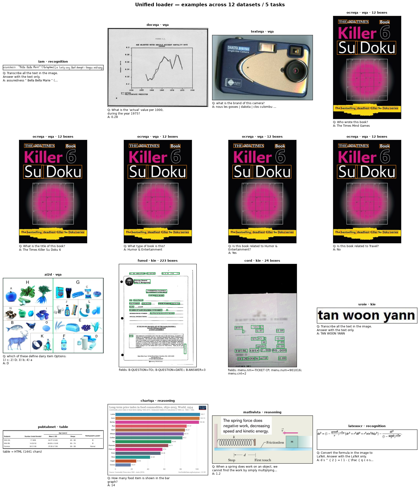
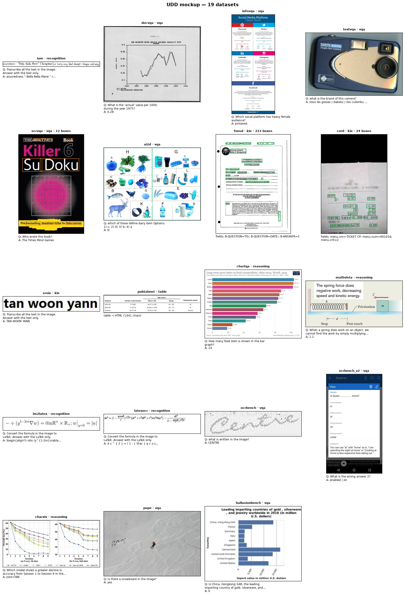

# Unified loader — one task-typed format for every OCR/document dataset

Every benchmark ships a different raw schema. To load them all through **one** pipeline and then
*freely merge / filter / re-task*, we normalise each into a single task-typed record,
[`UnifiedSample`](../../src/docvlm_eval/unified/), that **preserves the structured
payload** each task needs (KIE fields, localization boxes, table HTML, full text) — not just a
flat question/answer.

```python
from docvlm_eval.unified import UnifiedLoader, Task
L = UnifiedLoader()
rows  = L.load("cord", limit=50)                     # one dataset
allr  = L.load_all(limit_per=30, cache_dir="data/unified_dataset/images")
kie   = [r for r in allr["cord"] if r.task == Task.KIE]
boxes = [f for r in rows for f in r.fields if f.bbox]   # merge localized fields across sources
```

## The unified record

`UnifiedSample` (one item, any dataset):

| field | meaning |
| ----- | ------- |
| `task` | `recognition` / `kie` / `vqa` / `localization` / `table` / `reasoning` (what to filter/merge on) |
| `instruction`, `answers` | the prompt + gold answer(s) |
| `fields: [Field(key, value, bbox?)]` | **key-value extraction** (forms/receipts), optionally localized |
| `regions: [Region(label, bbox, text)]` | **localization / spotting** boxes |
| `full_text`, `table_html` | **recognition** target / **table** structure |
| `language`, `metric`, `image_path`, `source`, `hf_id`, `meta` | provenance + scoring |

Boxes carry a `normalized` flag (`[0,1]` vs pixel) so cross-dataset geometry is unambiguous.
`UnifiedSample.to_sample()` collapses a record back to the flat training
[`Sample`](../../src/docvlm_eval/schema.py) (deriving a target from `full_text`/`table_html`/`fields`
when there's no explicit answer), so the unified layer is a **superset** of `trainset.py`.

## Format variance handled (raw schema → unified)

Verified against the real datasets (not assumed):

| Benchmark | Raw shape | → task | Structured payload captured |
| --------- | --------- | ------ | --------------------------- |
| DocVQA / InfoVQA / TextVQA / ST-VQA | `question` + `answers[]` | vqa | answers |
| OCR-VQA | `questions[]` / `answers[]` + `ocr_info[{word, bounding_box}]` | vqa | **regions** (per-word, normalized 0–1) |
| ChartQA / MathVista / CharXiv | `question`/`query` + `answer` | reasoning | answers |
| AI2D | `question` + `options[]` + index `answer` | vqa | answer resolved from options |
| CORD | JSON `ground_truth.gt_parse` + `valid_line[{words[{text,quad}]}]` | kie | **fields** (flattened gt_parse) + **localized fields** (quad→pixel box) |
| FUNSD | `words[]` + `bboxes[]` (0–1000) + `ner_tags[]` | kie | **fields** with boxes (rescaled to 0–1) + `full_text` |
| SROIE | text/label | kie | answer (recognition-style) |
| PubTabNet / FinTabNet | `html_table` | table | `table_html` |
| IAM | `text` | recognition | `full_text` |
| im2latex / LaTeX_OCR | `latex`/`text` | recognition | formula text |
| OCRBench(+v2) / POPE / HallusionBench | `question` + `answer` | vqa | answers |
| *unregistered* | (any) | per `TASK_BY_BENCHMARK`, else vqa | via `trainset.extract_qa` fallback |

Records that yield no usable payload (e.g. detection-only streams with no text/QA) return `[]` and
are skipped.

## Easy extension — add a dataset in one function

The registry is a decorator. To support a new benchmark, write an extractor and register its catalog
key — nothing else changes:

```python
from docvlm_eval.unified import register, UnifiedSample, Task, _s

@register("my_new_bench")
def _u_my_bench(ex, e):
    return [UnifiedSample(
        sample_id="", source=e["key"], task=Task.KIE,
        instruction="Extract the fields.",
        fields=[Field(key=k, value=_s(v)) for k, v in ex["kv"].items()],
        metric="anls")]
```

Unregistered keys automatically fall back to the flat `trainset` adapter wrapped by task
(`TASK_BY_BENCHMARK`), so a new dataset works *immediately* as VQA/recognition even before you write
a typed extractor; the extractor just adds the structured payload.

## Build the standardized dataset

```bash
python scripts/build_unified_dataset.py --per-bench 50            # all streamable datasets
python scripts/build_unified_dataset.py --only cord,funsd,ocrvqa  # focused
python scripts/build_unified_dataset.py --task kie                # only KIE-yielding benchmarks
```

Outputs under `data/unified_dataset/` (git-ignored — regenerable):
`unified.jsonl` (rich, task-typed), `by_task/<task>.jsonl` (grouped), `train.jsonl` (flat trainable
Samples), `summary.json` (per-benchmark + per-task counts, incl. how many records carry boxes).

## Visualize examples across all datasets

```bash
python scripts/visualize_unified_dataset.py --per-bench 1
```

One montage cell per dataset: the image + a `source · task · N boxes` badge + a task-appropriate
overlay — **KIE field boxes in green, localization regions in orange** (normalized boxes are scaled to
the image), tables/recognition/vqa show the prompt+answer. This is the "see every dataset in one
standardized view" check that the loader mapped each source correctly.



(Programmatic API: `from docvlm_eval.unified import render_grid; render_grid(rows, "out.png")`.)

## UDD — the Unified Document Dataset on HuggingFace

`scripts/build_udd.py` turns the unified records into **UDD**, one HF dataset repo that holds every
benchmark under **one uniform schema** (`docvlm_eval.unified.hf`):

```
image, sample_id, source, task, instruction, answers[],
fields_json, regions_json, full_text, table_html, language, metric, hf_id
```

The structured payload (KIE fields, localization regions with boxes) is **JSON-encoded** into
`fields_json` / `regions_json`, so a single schema covers all six tasks without losing the typed
payload — decode those columns to recover `Field`/`Region` (boxes carry `[x1,y1,x2,y2,normalized]`).

**Safe, sharded, memory-bounded.** Each benchmark is converted **independently**, then:
1. **safety-checked** (`safety_check`): build → `save_to_disk` → reload → assert row count, image
   decode, and field/region counts all round-trip — **run before any upload**;
2. uploaded as its **own config** (`push_to_hub(repo, config_name=<key>, max_shard_size=...)`) and
   freed before the next, so the full corpus never sits in RAM and shards make download resumable;
3. a combined **`all`** config concatenates them.

```bash
# MOCKUP (default): 10 examples/dataset, saved locally + safety-checked + visualized (no upload)
python scripts/build_udd.py --only cord,funsd,ocrvqa,docvqa --per-bench 10

# upload the mockup to your HF (one config per dataset + an 'all' config)
python scripts/build_udd.py --per-bench 10 --push --repo <user>/UDD --token $HF_TOKEN
```

Load it back per dataset or combined:

```python
from datasets import load_dataset
cord = load_dataset("<user>/UDD", "cord", split="train")      # one benchmark
alld = load_dataset("<user>/UDD", "all", split="train", streaming=True)   # everything, streamed
```

**Validated mockup — all streamable datasets (10/dataset, safety-checked, 0 failures):**
**19/22 converters pass** → combined `all` = 230 rows across 5 tasks
(vqa 130, recognition 30, kie 30, reasoning 30, table 10). Highlights: cord/funsd→kie with boxes
(FUNSD 1769 fields, CORD 284), ocrvqa→vqa (1130 regions), pubtabnet→table, iam/im2latex/latexocr→
recognition, chartqa/mathvista/charxiv→reasoning. **3 documented skips** (no trainable GT in the
streamable split): `stvqa` (test split ships no answers), `pubtables1m` (detection webdataset — no
PIL image), `omnidocbench` (image-only stream; annotations in a separate file).



## Why this matters

One loader + one schema means the downstream "merge / extract-key-values / localize" operations the
fine-tuning pipeline needs are dataset-agnostic: a KIE-with-boxes trainer can pull `fields` from CORD
*and* FUNSD; a spotting trainer can pull `regions` from OCR-VQA and `fields[].bbox` from CORD/FUNSD;
a recognition trainer reads `full_text` — all from the same records, filtered by `task`.
