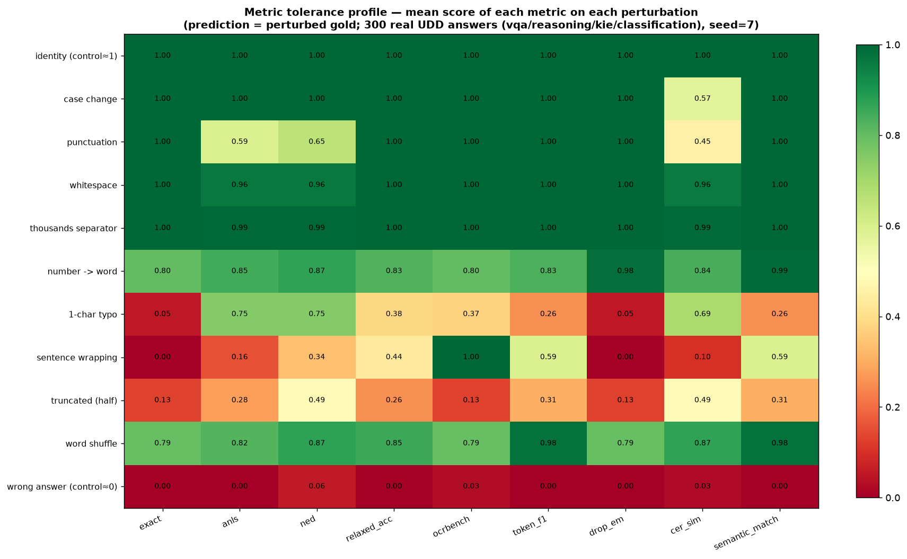

# Metric tendency — what each evaluation metric forgives

Prediction = a controlled perturbation of the gold; score = mean over 300 real UDD answers (vqa/reasoning/kie/classification), seed=7. A cell near 1.0 means the metric treats that change as still-correct; near 0.0 means it punishes it. `identity` and `wrong answer` are sanity controls.

| perturbation | exact | anls | ned | relaxed_acc | ocrbench | token_f1 | drop_em | cer_sim | semantic_match |
|---|---|---|---|---|---|---|---|---|---|
| identity (control≈1) | 1.00 | 1.00 | 1.00 | 1.00 | 1.00 | 1.00 | 1.00 | 1.00 | 1.00 |
| case change | 1.00 | 1.00 | 1.00 | 1.00 | 1.00 | 1.00 | 1.00 | 0.57 | 1.00 |
| punctuation | 1.00 | 0.59 | 0.65 | 1.00 | 1.00 | 1.00 | 1.00 | 0.45 | 1.00 |
| whitespace | 1.00 | 0.96 | 0.96 | 1.00 | 1.00 | 1.00 | 1.00 | 0.96 | 1.00 |
| thousands separator | 1.00 | 0.99 | 0.99 | 1.00 | 1.00 | 1.00 | 1.00 | 0.99 | 1.00 |
| number -> word | 0.80 | 0.85 | 0.87 | 0.83 | 0.80 | 0.83 | 0.98 | 0.84 | 0.99 |
| 1-char typo | 0.05 | 0.75 | 0.75 | 0.38 | 0.37 | 0.26 | 0.05 | 0.69 | 0.26 |
| sentence wrapping | 0.00 | 0.16 | 0.34 | 0.44 | 1.00 | 0.59 | 0.00 | 0.10 | 0.59 |
| truncated (half) | 0.13 | 0.28 | 0.49 | 0.26 | 0.13 | 0.31 | 0.13 | 0.49 | 0.31 |
| word shuffle | 0.79 | 0.82 | 0.87 | 0.85 | 0.79 | 0.98 | 0.79 | 0.87 | 0.98 |
| wrong answer (control≈0) | 0.00 | 0.00 | 0.06 | 0.00 | 0.03 | 0.00 | 0.00 | 0.03 | 0.00 |

Reading guide: `exact` collapses on every change except pure surface noise it normalizes away; `anls`/`ned` forgive small edits (typos) but not semantic rewrites (number->word); `drop_em` is the only EM that survives number->word and separators; `token_f1` uniquely gives credit through sentence wrapping and word shuffle (order-free); `cer_sim` degrades smoothly with edit distance; `semantic_match` = the layered union (surface OR canonical OR token overlap).

Re-run on real model outputs: `python scripts/compare_metrics.py --preds <predictions.jsonl>` -> per-metric means + Pearson correlations + top disagreements.
