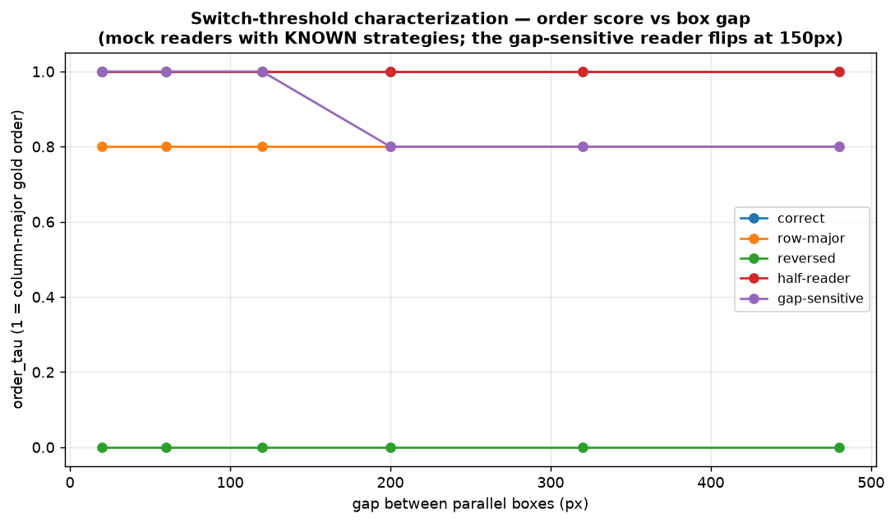

# Reading order — content/order split + switch characterization

Score ORDER separately from CONTENT (`metrics/order.py`): `content_bag` = fraction of elements read at all; `order_tau` = normalized Kendall rank correlation of the found elements vs the gold reading order. The GAP isolates order failures from recognition failures. Mock readers with known strategies validate the measurement:

| reader | boxes (content / order) | ltr (content / order) | tategaki (content / order) | twocol (content / order) |
|---|---|---|---|---|
| correct | 1.00 / 1.00 | 1.00 / 1.00 | 1.00 / 1.00 | 1.00 / 1.00 |
| row-major | 1.00 / 0.80 | 1.00 / 0.80 | 1.00 / 0.80 | 1.00 / 0.80 |
| reversed | 1.00 / 0.00 | 1.00 / 0.00 | 1.00 / 0.00 | 1.00 / 0.00 |
| half-reader | 0.50 / 1.00 | 0.50 / 1.00 | 0.50 / 1.00 | 0.50 / 1.00 |
| gap-sensitive | 1.00 / 1.00 | 1.00 / 1.00 | 1.00 / 1.00 | 1.00 / 1.00 |

Reading guide: `row-major` and `reversed` keep content 1.00 while order collapses — exactly the failure a plain transcript metric cannot see; `half-reader` shows the inverse (content 0.50, order 1.00). Each probe image also carries a **k-th element** QA and a **segmentation-count** QA (exact) — correlate segmentation accuracy with order accuracy across real models to test the hypothesis that paragraph/layout segmentation is the capability underlying reading order.

The gap-sweep curve above is the *logic-switch* characterization: a real model's `order_tau` plotted against the box gap reveals where (and whether cleanly) its reading strategy flips between column-major and row-major — the `gap-sensitive` mock reader shows the signature shape.

## Public-data validation

_merged corpus not on disk — OmniDocBench section pending rebuild_
