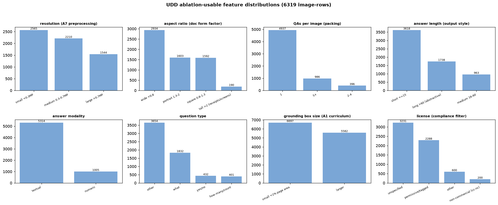

# UDD — additional ablation-usable features

Corpus: 6319 image-rows. Beyond the wired dimensions (task / language / fold / grounding / derived rationales), these column-derived dimensions have enough bucket support to ablate (equal-N buckets are the constraint):

- **resolution (A7 preprocessing)** — small <0.3MP: **2565**, medium 0.3-0.7MP: **2210**, large >0.7MP: **1544**
- **aspect ratio (doc form factor)** — wide <0.8: **2934**, portrait 1.3-2: **1603**, square 0.8-1.3: **1592**, tall >2 (receipts/screens): **190**
- **QAs per image (packing)** — 1: **4937**, 5+: **986**, 2-4: **396**
- **answer length (output style)** — short <=15: **3618**, long >60 (abstractive): **1738**, medium 16-60: **963**
- **answer modality** — textual: **5314**, numeric: **1005**
- **question type** — other: **3654**, what: **1832**, yes/no: **432**, how-many/count: **401**
- **grounding box size (A1 curriculum)** — small <1% page area: **6697**, larger: **5582**
- **license (compliance filter)** — unspecified: **3231**, permissive/tagged: **2288**, other: **600**, non-commercial (cc-nc): **200**

## Proposed new arms

| arm | bucket recipe (column filter) | hypothesis |
|---|---|---|
| U-A7 resolution strata | filter by `image_width*image_height` buckets | training on high-res pages moves small-text NED more than equal-N low-res |
| U-A8 QA packing | images with 5+ QAs (`len(instructions)`) vs 1-QA images at equal QA budget | many-QAs-per-image amortizes vision compute AND teaches multi-field reading — beats 1 QA/image |
| U-A9 output style | short (<=15 chars) vs long (>60) answer rows | long-answer training degrades exact/anls on short-answer eval (verbosity bias) — measure the interference |
| U-A10 numeric reasoning | rows whose gold is numeric (16% of corpus) | numeric-only training moves chart/relaxed_acc without touching text extraction |
| U-A11 grounding difficulty | region rows split by box area (55% of boxes <1% page) | curriculum large->small boxes beats mixed-size grounding at equal N (A1 refinement) |
| U-A12 form factor | aspect-ratio buckets (tall receipts/screens vs wide pages) | form-factor-matched training transfers within factor, weakly across |
| license filter | drop cc-by-nc rows (200) from training | compliance-safe training costs nothing measurable (only MTVQA is NC) |

All recipes are pure column filters on the live schema — no new data collection; `build_task_trainsets.py`-style equal-N subsampling + `run_ablation --arm public` run them unchanged. Support caveats: `when/where` question types are too thin (41/20 rows) to ablate; `tall` aspect has 190 rows — pair it with a lowered --count.
