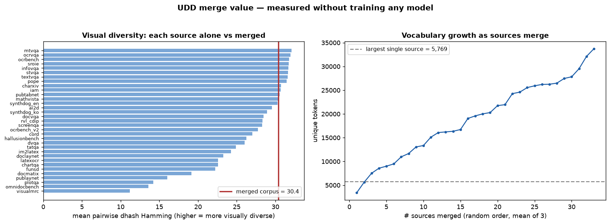

# UDD merge value — what merging buys, measured without training

Corpus: 5675 rows, 33 sources, 3250 distinct images.

| signal | best single source | merged corpus | gain |
|---|---|---|---|
| task coverage | 1 / 7 tasks | **7 tasks** | complete |
| language coverage | 2 | **6** (ar, en, id, ko, und, zh) | ×3.0 |
| payload types (fields/boxes/table/full-text) | 2 / 4 | **4** | complete |
| visual diversity (mean pairwise dhash Hamming) | 26.4 avg within-source (max 32.1) | **30.4** | +15% vs avg source |
| vocabulary | 5,769 tokens (largest source) | **33,722** | ×5.8 |
| cross-source redundancy | — | **0.7%** of images have a strict near-dup in another source | merging adds ~99% new data |

## Verdict

Merging is worth it on dataset-level evidence alone:

1. **No single source spans the training surface.** The best source covers 1 of 7 tasks and 2 of 6 languages; a trainer needing KIE boxes + layout localization + Korean text has no single-source option.
2. **The merged input distribution is measurably wider** — pairwise visual diversity 30.4 vs 26.4 within an average source — without collapsing into duplicates (near-linear vocabulary growth; sources contribute complementary content).
3. **Redundancy is negligible** (0.7% strict near-dups, see `udd_duplicates.md`), so each merged source adds data, not copies — the audit still matters for train/val hygiene (chartqa↔mathvista).

What this analysis **cannot** show is whether the wider distribution transfers to model capability at a fixed budget — that is exactly the GPU task-value ablation (`run_task_value.py`) and the A1/A4 hypothesis runs (`build_task_trainsets.py --group-by task|language`).
