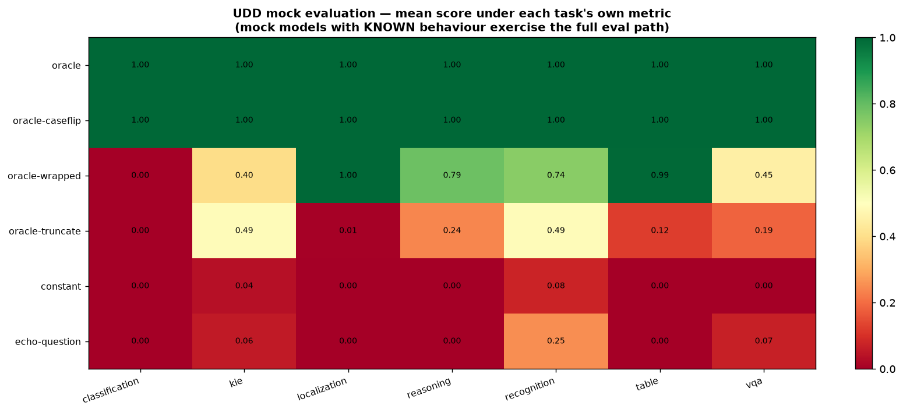

# UDD mock multi-model evaluation (no GPU — deterministic mock models)

1050 public-heldout samples; per-task metrics: classification=exact; kie=anls/ned; localization=grounding; reasoning=relaxed_acc; recognition=ned; table=anls; vqa=anls/exact

Each cell = mean score under the task's OWN metric (per-sample `score_sample` dispatch), with `semantic_match` in parentheses as the bank comparison.

## What each mock model is

Every "model" is a deterministic rule applied to the gold answer or the question — a KNOWN behaviour, so every cell has an expected value and any deviation localizes a bug (loading, metric dispatch, aggregation). Example: question *"What is the total amount?"*, gold `24,000 KRW`:

| mock | answers with | simulates | expected score |
|---|---|---|---|
| `oracle` | the gold verbatim: `24,000 KRW` | a perfect reader | ≈1.0 under EVERY metric — anything less means the eval pipeline itself is broken |
| `oracle-caseflip` | the gold with letter case flipped: `24,000 krw` | a correct reader that changes case (the "Total" vs "total" problem) | 1.0 under case-tolerant metrics; drops under case-sensitive `exact` |
| `oracle-wrapped` | `The answer is 24,000 KRW.` | a chatty model wrapping the right answer in a sentence | 1.0 under substring/F1-tolerant metrics; 0 under strict `exact` |
| `oracle-truncate` | the first half of the gold: `24,00` | a partial reader that stops mid-answer | partial credit under edit-distance metrics (`anls`/`ned`); 0 under `exact` |
| `constant` | always `unknown` | a useless model that never reads the image | ≈0.0 everywhere — if it scores, that task/metric can be gamed without reading |
| `echo-question` | the question text itself | degenerate output copying prompt words | ≈0.0 — guards against metrics that reward question-word overlap |

## Scores

| model | classification | kie | localization | reasoning | recognition | table | vqa |
|---|---|---|---|---|---|---|---|
| oracle | 1.00 (1.00) | 1.00 (1.00) | 1.00 (1.00) | 1.00 (1.00) | 1.00 (1.00) | 1.00 (1.00) | 1.00 (1.00) |
| oracle-caseflip | 1.00 (1.00) | 1.00 (1.00) | 1.00 (1.00) | 1.00 (1.00) | 1.00 (1.00) | 1.00 (1.00) | 1.00 (1.00) |
| oracle-wrapped | 0.00 (0.53) | 0.40 (0.62) | 1.00 (0.67) | 0.79 (0.51) | 0.74 (0.87) | 0.99 (1.00) | 0.45 (0.76) |
| oracle-truncate | 0.00 (0.06) | 0.49 (0.46) | 0.01 (0.00) | 0.24 (0.09) | 0.49 (0.58) | 0.12 (0.66) | 0.19 (0.48) |
| constant | 0.00 (0.00) | 0.04 (0.00) | 0.00 (0.00) | 0.00 (0.00) | 0.08 (0.00) | 0.00 (0.00) | 0.00 (0.00) |
| echo-question | 0.00 (0.07) | 0.06 (0.00) | 0.00 (0.00) | 0.00 (0.00) | 0.25 (0.03) | 0.00 (0.02) | 0.07 (0.31) |

Sanity: `oracle` ≈ 1.0 and `constant` ≈ 0.0 in every column; the gap between `oracle-caseflip` / `oracle-wrapped` / `oracle-truncate` rows and 1.0 is each task metric's tolerance profile applied to real UDD golds (compare [`metric_tendency.md`](metric_tendency.md)).

