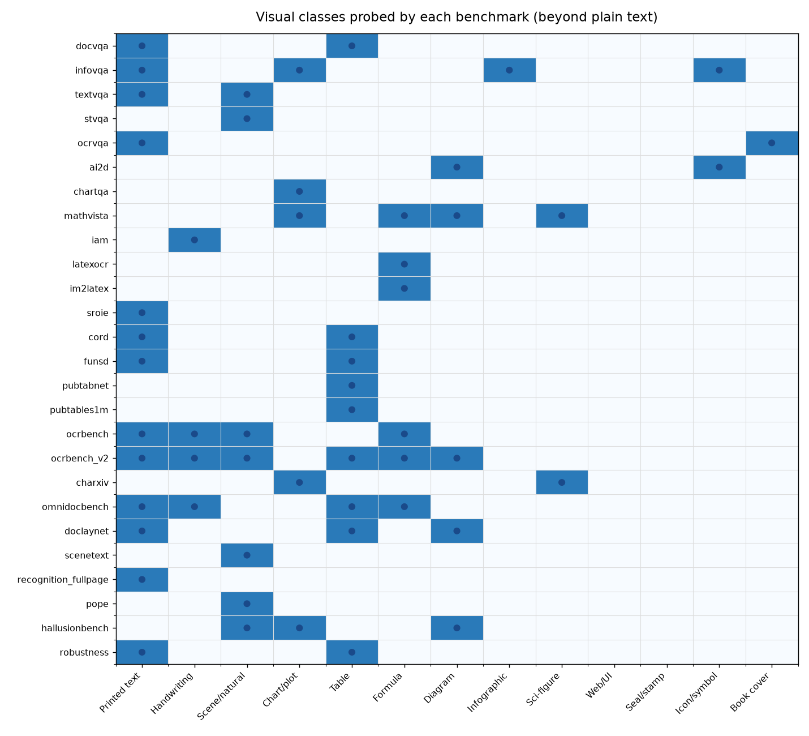
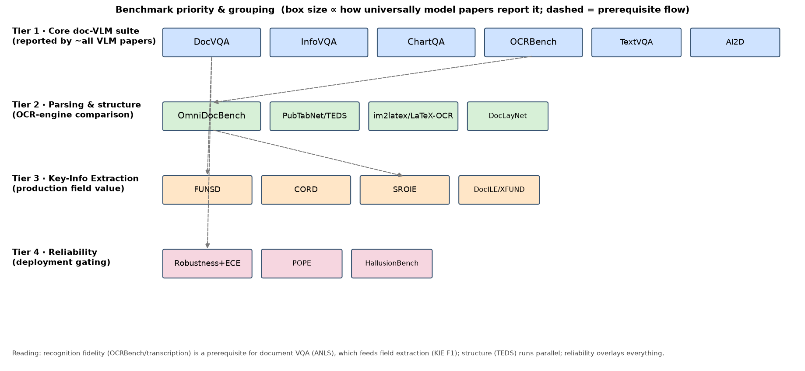

# Benchmark patterns: what the suite actually collects, and how it groups

This note answers four questions about the 42-benchmark catalog
([`../configs/benchmark_catalog.yaml`](../configs/benchmark_catalog.yaml)):

1. **What information** is each benchmark ultimately collecting? (patterns)
2. **Which visual classes beyond plain text** do they probe? (charts, formulas, diagrams,
   handwriting, QR/seal, …)
3. **How many "natures" of VQA** are there — when is it a single exact answer vs. a *list* of
   acceptable answers (fuzzy / ANLS) vs. multiple-choice?
4. **How do benchmarks group**, and what is the **priority relationship** between groups,
   grounded in what the model papers actually report?

---

## A. What information each benchmark collects (patterns)

Every benchmark reduces to one of a small number of **answer/output patterns**. This is the
key insight: the *output type* — not the topic — decides the metric and the difficulty.

| Output pattern                | What it collects                         | Benchmarks                                            | Metric family                |
| ----------------------------- | ---------------------------------------- | ----------------------------------------------------- | ---------------------------- |
| **Span answer (single gold)** | one exact short string                   | ChartQA, AI2D, MathVista, OCR-VQA, POPE               | exact / relaxed / MCQ acc    |
| **Span answer (gold *list*)** | several acceptable strings per question  | DocVQA, InfoVQA, ST-VQA, TextVQA, OCRBench            | **ANLS** / VQA-agreement     |
| **Full transcription**        | the entire text/LaTeX of the image       | IAM, recognition_fullpage, im2latex, LaTeX-OCR, (GOT) | CER / WER / NED / BLEU       |
| **Structured record**         | typed fields + key→value links           | FUNSD, CORD, SROIE, DocILE, XFUND                     | entity / relation **F1**     |
| **Structure tree**            | table rows/cols/cells (HTML/XML)         | PubTabNet, PubTables-1M, SciTSR                       | **TEDS / GriTS**             |
| **Whole-page layout+content** | every element + reading order            | OmniDocBench, DocLayNet, Fox, READoc                  | edit-dist / TEDS / CDM / mAP |
| **Reliability signal**        | correctness *and* confidence/consistency | robustness, POPE, HallusionBench, KIE-HVQA            | retention / **ECE** / F1     |

**Pattern takeaways**
- The "document understanding" label hides **seven different output contracts**. A model can
  ace span-answer ANLS yet be unable to emit a structure tree (TEDS) — they test different
  heads/skills.
- **Field value** ("did it extract the right total?") is a *structured-record* task → **entity
  F1**, not VQA accuracy. **Cell relationships** ("which cells relate?") is a *structure-tree*
  task → **TEDS/GriTS**. This is why the suite needs more than DocVQA.

## B. Visual classes beyond plain text

Documents are not just printed characters. The matrix below (figure) shows which **visual
classes** each benchmark forces the model to handle — charts, tables, formulas, diagrams,
handwriting, infographics, scientific figures, icons, book covers, scene/natural images.

**What to watch beyond text (diversity summary)**
- **Charts/plots** → ChartQA, MathVista, CharXiv, InfoVQA, HallusionBench
- **Tables (structure + cells)** → PubTabNet, PubTables-1M, CORD, OmniDocBench, DocVQA
- **Formulas (LaTeX / handwritten math)** → im2latex, LaTeX-OCR, CROHME, MathVista, OCRBench
- **Diagrams / schematics** → AI2D, MathVista, OmniDocBench(figures), DocLayNet
- **Handwriting** → IAM, OCRBench(HME), OmniDocBench
- **Infographics / icons** → InfoVQA
- **Scientific figures** → CharXiv, MathVista
- **Scene/natural text** → TextVQA, ST-VQA, scenetext
- **Book covers** → OCR-VQA
- **Coverage gaps in our suite (honest):** **Web/UI screenshots** (VisualMRC — documented,
  no sample) and **seals/stamps** (a PaddleOCR-VL-1.5 capability) are *not* yet exercised with
  a sample → candidates to add next. **QR/barcodes** are also absent from mainstream sets.

## C. The several "natures" of VQA (answer cardinality & fuzziness)

Even within VQA, evaluation differs by **how the gold answer is shaped** — verified directly
from the fetched samples:

| Nature                         | Example (from samples)                 | Why it exists                                                                                                                    | How we score it                                      |
| ------------------------------ | -------------------------------------- | -------------------------------------------------------------------------------------------------------------------------------- | ---------------------------------------------------- |
| **Single, unambiguous**        | ChartQA `answer:"42"`, AI2D MCQ        | the question pins one value                                                                                                      | exact / relaxed / option match                       |
| **Multiple acceptable (list)** | DocVQA `answers:[…]`, ST-VQA, OCRBench | the question is *slightly under-specified* (formatting, synonyms, "$1,200" vs "1200"), so authors ship **a list of valid golds** | **ANLS over the list** (take the best-matching gold) |
| **Many human answers**         | TextVQA `answers:[10]`                 | open phrasing → consensus needed                                                                                                 | **VQA accuracy** = min(#agree/3, 1) over 10          |
| **Multiple per image**         | OCR-VQA `questions/answers` lists      | several Q&A on one cover                                                                                                         | per-question scoring, then averaged                  |
| **Multiple-choice**            | AI2D `options`, MathVista `choices`    | constrains the answer space                                                                                                      | option accuracy                                      |

This is exactly the point that *"a clear question only needs an is-it-right check, but a vague
question has a diversity of valid answers, supplied as a list to make LMM judgement easy"*: it
is **why DocVQA/ST-VQA/OCRBench ship answer *lists* and are scored with ANLS** (fuzzy,
best-of-list) rather than strict equality, and why TextVQA uses 10-annotator agreement. Our
pipeline already implements this: `metrics.text.anls` takes `max` over the gold list with the
0.5 threshold, `relaxed_accuracy` adds the 5% numeric tolerance, `exact_match` for the pinned
cases — dispatched per-sample by the `metric` field, so each "nature" is scored correctly.

## D. Grouping and priority relationship

Reading the sub-1B model papers (InternVL2.5/3, SmolVLM, LLaVA-OneVision report DocVQA /
InfoVQA / ChartQA / OCRBench / TextVQA / AI2D; the OCR engines — PaddleOCR-VL, GOT-OCR2.0,
dots.ocr, MonkeyOCR — report OmniDocBench), the benchmarks fall into **four priority tiers**
with a clear prerequisite flow:

| Tier  | Group               | Benchmarks                                                  | Who reports it             | Role                                      |
| ----- | ------------------- | ----------------------------------------------------------- | -------------------------- | ----------------------------------------- |
| **1** | Core doc-VLM suite  | DocVQA, InfoVQA, ChartQA, OCRBench, TextVQA, AI2D           | **~all** sub-1B VLM papers | headline comparability; report first      |
| **2** | Parsing & structure | OmniDocBench, PubTabNet/TEDS, im2latex/LaTeX-OCR, DocLayNet | OCR-engine papers          | compares *transcription/structure* models |
| **3** | Key-Info Extraction | FUNSD, CORD, SROIE, DocILE/XFUND                            | doc-AI / layout papers     | production field-value extraction         |
| **4** | Reliability         | robustness+ECE, POPE, HallusionBench, KIE-HVQA              | rarely reported            | deployment gating (the differentiator)    |

**Priority logic (the relationships)**
- **Recognition is prerequisite for reasoning.** OCRBench / transcription fidelity (CER/NED)
  underpins everything; if a model cannot read the pixels, DocVQA ANLS and KIE F1 collapse.
  → evaluate Tier-1 recognition-heavy items before trusting reasoning scores.
- **VQA feeds extraction.** DocVQA-style reading is the substrate for FUNSD/SROIE field
  extraction; structure (TEDS) runs in parallel (a different head).
- **Report what peers report, then differentiate.** Tier 1 buys apples-to-apples comparability
  with published numbers; **Tiers 3–4 (KIE F1, calibration, robustness) are where a small model
  is actually selected for deployment**, and where leaderboards are silent — so they carry the
  most *decision* weight even though they are reported least.

**Recommended evaluation order for this PoC:** Tier 1 (anchor + comparability) → Tier 4
reliability overlay on the Tier-1 leader (the cheap, high-signal differentiator already built
into the pipeline) → Tier 2/3 structure & KIE as the model matures toward production parsing.

---

*Figures regenerated with `python scripts/plot_benchmark_map.py`; class/answer mappings are
derived from the catalog and verified against the fetched `data/benchmarks/*/sample.json`.*
